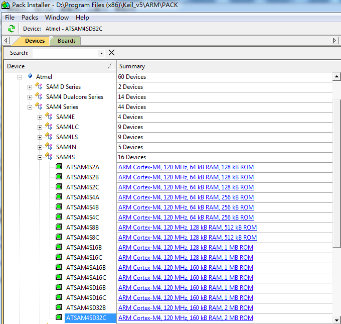
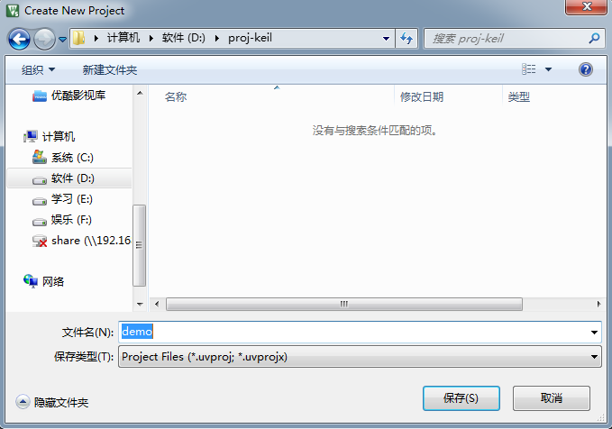
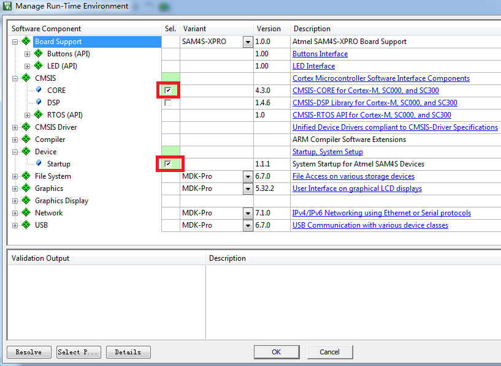
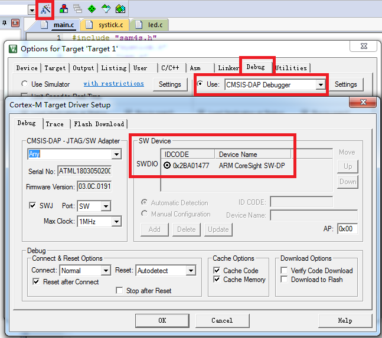

本次收到的开发板是ATSAM4S-XPRO，首先看看开发板的MCU吧，型号：SAM4SD32C

- ARM Cortex-M4 内核
- 最高工作频率 120 MHz
- FLASH 2048 KB
- SRAM 160 KB

详细信息参见：

[http://www.atmel.com/zh/cn/devices/ATSAM4SD32C.aspx](http://www.atmel.com/zh/cn/devices/ATSAM4SD32C.aspx)

总体来看还是不错的。

上次已经分享了开箱照，那么接下来就可以开干了，首先就是搭建开发环境。

作为一个普通单片机开发者，Keil和IAR是我们经常使用的开发环境，两者的界面都比较友好而且调试功能强大，如果能在Keil或IAR上进行开发相信是比较方便的。本文就是笔者以Keil平台为例搭建开发环境的流程记录。

当然，需要补充的是，首先，ATMEL公司也有其自己的开发环境：Atmel Studio，最新的Atmel Studio 7.0的界面跟Visual Studio如出一辙，但是安装起来还需要Visual Studio 2015相关支持，所以完整安装下来很占空间，笔者就放弃了。然后，ATMEL针对其MCU也有一套库：ASF(Atmel Software Framework)，类似于STM32的标准库，对MCU的学习是很有帮助的，但是这个库一般是结合Atmel Studio使用，IAR好像也可以，笔者目前没有查证，所以在Keil上我们还是回到原始的寄存器层面开发。

##Keil开发环境搭建

1.在最新的Keil5环境中，器件以pack形式管理，在开发前，我们需要先安装对应pack，所以先去keil官网搜索MCU相关信息，查找相关资源；

[http://www.keil.com/dd2/atmel/atsam4sd32c/](http://www.keil.com/dd2/atmel/atsam4sd32c/ "atsam4sd32c")

点击download下载安装即可，安装后效果如下：

2.接下来就可以创建新的工程了

project->New uVision Project...->工程路径及工程名->选择器件：ATSAM4SD32C->选择包：CMSIS+DEVICE

整个过程完成后，我们可以看到如下工程目录树：

可以看到启动汇编文件和系统函数C文件已经加入，我们再加入main函数，完成入门实验：点亮LED

3.点亮LED灯

新建main.c systick.c led.c文件，源码如下：

main.c:

<pre>
#include "sam4s.h"
#include "systick.h"
#include "led.h"

int main(void)
{
	SystemInit();
	SystemCoreClockUpdate();
	SysTick_Config(SystemCoreClock/1000); //1ms
	
	LED_Init();
	
	while(1)
	{
		LED_On();
		delay_ms(500);
		LED_Off();
		delay_ms(500);
	}
}
</pre>

systick.c:

<pre>
#include "sam4s.h"                    
#include "systick.h" 

static volatile unsigned int TIME_DELAY=0;

void delay_ms(unsigned int n)
{
  TIME_DELAY = n;
  while(TIME_DELAY != 0x00);
}

void SysTick_Handler()
{
   if(TIME_DELAY !=0x00 )
    {
        TIME_DELAY--;
    }
}
</pre>

led.c:

<pre>
#include "sam4s.h"                    
#include "led.h"                 

void LED_Init(void) 
{
  PMC->PMC_WPMR = 0x504D4300;             /* Disable write protect            */

  PMC->PMC_PCER0 = (1UL << ID_PIOC);      /* enable PIOC clock                */

  PIOC->PIO_PER  =
  PIOC->PIO_OER  =
  PIOC->PIO_PUDR =
  PIOC->PIO_OWER = (PIO_PC23);            /* Setup PC23 for LEDs              */
	
  LED_Off();

  PMC->PMC_WPMR = 0x504D4301;             /* Enable write protect             */
}

void LED_On(void)
{
    PIOC->PIO_CODR = PIO_PC23;
}

void LED_Off(void)
{
    PIOC->PIO_SODR = PIO_PC23;
}
</pre>

最终效果如下：

以上程序中时钟部分是Keil的Device中system_SAM4S.c已经写好的，LED相关的PIO寄存器操作需要参考上面提到的ASF或者pack中自带的LED例程，也就是选择CMSIS的时候勾选Board Support，学习其源码。

4.编译无误后，通过USB插到开发板DEBUG_USB口，等待板载仿真器安装驱动后，进行如下设置：

选择CMSIS-DAP仿真器，可以发现仿真器信息已经自动识别。

5.下载程序，LED点亮了呢...