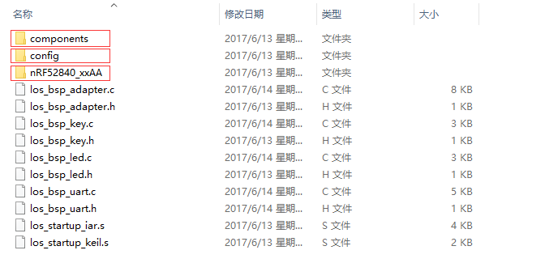
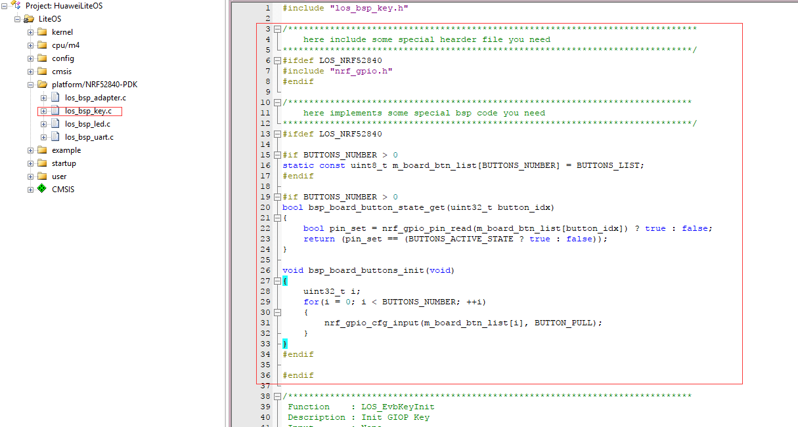
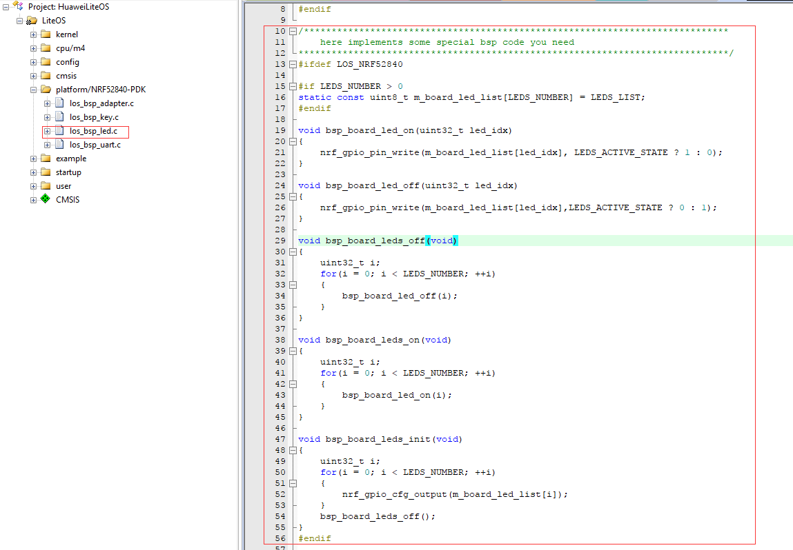
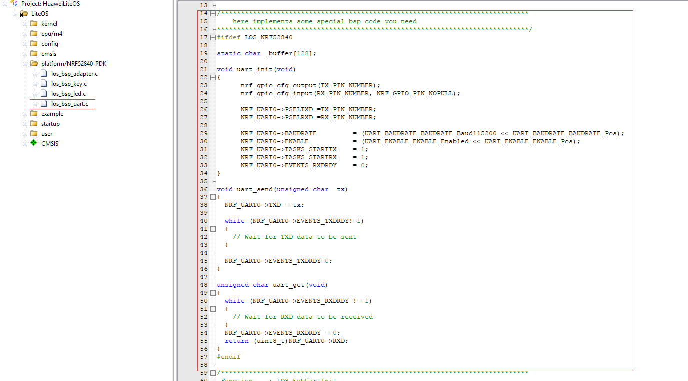
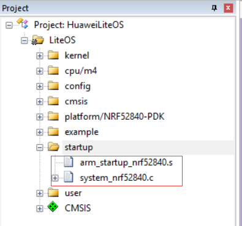
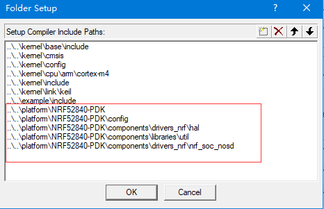
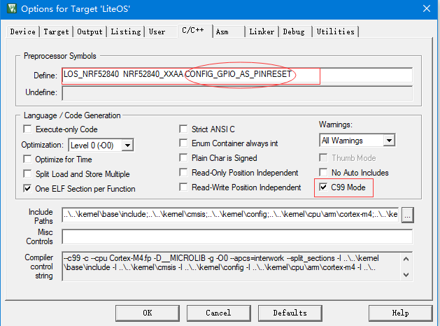
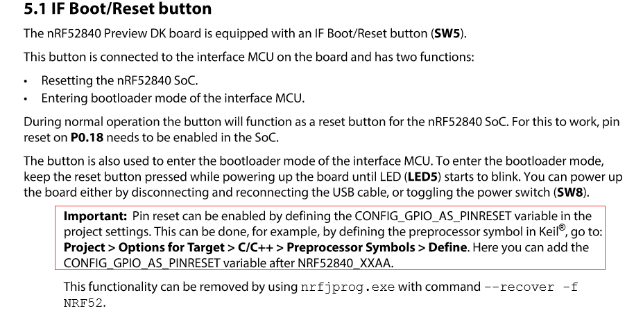

## 1关于本文档的开源协议说明
**您可以自由地：**

**分享** 

- 在任何媒介以任何形式复制、发行本文档

**演绎** 

- 修改、转换或以本文档为基础进行创作。只要你遵守许可协议条款，许可人就无法收回你的这些权利。

**惟须遵守下列条件：**

**署名** 

- 您必须提供适当的证书，提供一个链接到许可证，并指示是否作出更改。您可以以任何合理的方式这样做，但不是以任何方式表明，许可方赞同您或您的使用。

**非商业性使用** 

- 您不得将本作品用于商业目的。

**相同方式共享** 

- 如果您的修改、转换，或以本文档为基础进行创作，仅得依本素材的
授权条款来散布您的贡献作品。

**没有附加限制** 

- 您不能增设法律条款或科技措施，来限制别人依授权条款本已许可的作为。

**声明：**

-  当您使用本素材中属于公众领域的元素，或当法律有例外或限制条款允许您的使用，
则您不需要遵守本授权条款。
未提供保证。本授权条款未必能完全提供您预期用途所需要的所有许可。例如：形象
权、隐私权、著作人格权等其他权利，可能限制您如何使用本素材。

**注意**

- 为了方便用户理解，这是协议的概述. 可以访问网址 https://creativecommons.org/licenses/by-sa/3.0/legalcode 了解完整协议内容.

## 2前言
### 目的
本文档介绍基于Huawei LiteOS如何移植到第三方开发板，并成功运行基础示例。
### 读者对象
本文档主要适用于Huawei LiteOS Kernel的开发者。
本文档主要适用于以下对象：
- 物联网端软件开发工程师
- 物联网架构设计师

### 符号约定
在本文中可能出现下列标志，它们所代表的含义如下。

     用于警示紧急的危险情形，若不避免，将会导致人员死亡或严重的人身伤害

    用于警示潜在的危险情形，若不避免，可能会导致人员死亡或严重的人身伤害

    用于警示潜在的危险情形，若不避免，可能会导致中度或轻微的人身伤害

     用于传递设备或环境安全警示信息，若不避免，可能会导致设备损坏、数据丢失、设备性能降低或其它不可预知的结果“注意”不涉及人身伤害

| 说明	|		“说明”不是安全警示信息，不涉及人身、设备及环境伤害信息	|

### 修订记录
修改记录累积了每次文档更新的说明。最新版本的文档包含以前所有文档版本的更新
内容。

<table>
	<tr>
	<td>日期</td>
	<td>修订版本</td>
	<td>描述</td>
	</tr>
	<tr>
	<td>2017年06月14日</td>
	<td>1.0</td>
	<td>完成初稿</td>
	</tr>
</table>

## 3 概述

目前在github上的Huawei LiteOS内核源码已适配好部分芯片的内核工程，本手册将以NRF52840芯片为例，介绍基于Cortex M4核芯片的驱动移植过程。

## 4 环境准备
基于Huawei LiteOS Kernel开发前，我们首先需要准备好单板运行的环境，包括软件环
境和硬件环境。
硬件环境：

<table>
	<tr>
	<td>所需硬件</td>
	<td>描述</td>
	</tr>
	<tr>
	<td>NRF52840-PDK单板</td>
	<td>NRF开发板(芯片型号NRF52840)</td>
	</tr>
	<tr>
	<td>PC机</td>
	<td>用于编译、加载并调试镜像</td>
	</tr>
	<tr>
	<td>电源（5v）</td>
	<td>开发板供电(使用MICRO USB连接线)</td>
	</tr>
</table>

软件环境：

<table>
	<tr>
	<td>软件</td>
	<td>描述</td>
	</tr>
	<tr>
	<td>Window 10 操作系统</td>
	<td>安装Keil和JLINK的操作系统</td>
	</tr>
	<tr>
	<td>Keil(5.20及以上版本)</td>
	<td>用于编译、链接、调试程序代码
	uVision V5.20 MDK-Lite uVersion:5.20</td>
	</tr>
	<tr>
	<td>J-Link V4.86b</td>
	<td>开发板与pc连接的驱动程序，用户加载及调试程序代码</td>
	</tr>
</table>

**说明**

Keil工具需要开发者自行购买，JLink的驱动程序可以从官网获取。

## 5获取Huawei LiteOS 源码

首先我们需要通过网络下载获取Huawei LiteOS开发包。目前Huawei LiteOS的代码已经
开源，可以直接从网络上获取，步骤如下：

- 仓库地址是https://github.com/LITEOS/LiteOS_Kernel.git 

- 点击”clone or download”按钮,下载源代码

- 目录结构如下：Huawei LiteOS的源代码目录的各子目录包含的内容如下：

关于代码树中各个目录存放的源代码的相关内容简介如下：

<table>
<tr>
	<td>一级目录</td>
	<td>二级目录</td>
	<td>说明</td>
</tr>
<tr>
	<td>doc</td>
	<td></td>
	<td>此目录存放的是LiteOS的使用文档和API说明文档</td>
</tr>
<tr>
	<td>example</td>
	<td>api</td>
	<td>此目录存放的是内核功能测试用的相关用例的代码</td>
</tr>
<tr>
	<td></td>
	<td>include</td>
	<td>aip功能头文件存放目录</td>
</tr>
<tr>
	<td>kernel</td>
	<td>base</td>
	<td>此目录存放的是与平台无关的内核代码，包含核心提供给外部调用的接口的头文件以及内核中进程调度、进程通信、内存管理等等功能的核心代码。用户一般不需要修改此目录下的相关内容。</td>
</tr>
<tr>
	<td></td>
	<td>cmsis</td>
	<td>LiteOS提供的cmsis接口</td>
</tr>
<tr>
	<td></td>
	<td>config</td>
	<td>此目录下是内核资源配置相关的代码，在头文件中配置了LiteOS所提供的各种资源所占用的内存池的总大小以及各种资源的数量，例如task的最大个数、信号量的最大个数等等</td>
</tr>
<tr>
	<td></td>
	<td>cpu</td>
	<td>此目录以及以下目录存放的是与体系架构紧密相关的适配LiteOS的代码。比如目前我们适配了arm/cortex-m4及arm/cortex-m3系列对应的初始化内容。</td>
</tr>
<tr>
	<td></td>
	<td>include</td>
	<td>内核的相关头文件存放目录</td>
</tr>
<tr>
	<td></td>
	<td>link</td>
	<td>与IDE相关的编译链接相关宏定义</td>
</tr>
<tr>
	<td>platform</td>
	<td>GD32F190R-EVAL</td>
	<td>GD190开发板systick以及led、uart、key驱动bsp适配代码</td>
</tr>
<tr>
	<td></td>
	<td>GD32F450i-EVAL</td>
	<td>GD450开发板systick以及led、uart、key驱动bsp适配代码</td>
</tr>
<tr>
	<td></td>
	<td>STM32F412ZG-NUCLEO</td>
	<td>STM32F412开发板systick以及led、uart、key驱动bsp适配代码</td>
</tr>
<tr>
	<td></td>
	<td>STM32F411RE-NUCLEO</td>
	<td>STM32F411开发板systick以及led、uart、key驱动bsp适配代码</td>
</tr>
<tr>
	<td></td>
	<td>STM32F429I_DISCO</td>
	<td>STM32F429开发板systick以及led、uart、key驱动bsp适配代码</td>
</tr>
<tr>
	<td></td>
	<td>STM32L476RG_NUCLEO</td>
	<td>STM32L476开发板systick以及led、uart、key驱动bsp适配代码</td>
</tr>
<tr>
	<td></td>
	<td>LOS_EXPAND_XXX</td>
	<td>用于新扩展的开发板systick以及led、uart、key驱动bsp适配代码</td>
</tr>
<tr>
	<td>projects</td>
	<td>STM32F412ZG-NUCLEO-KEIL</td>
	<td>stm32f412开发板的keil工程目录</td>
</tr>
<tr>
	<td></td>
	<td>STM32F411RE-NUCLEO-KEIL</td>
	<td>stm32f411开发板的keil工程目录</td>
</tr>
<tr>
	<td></td>
	<td>STM32F429I_DISCO_IAR</td>
	<td>stm32f429开发板的iar工程目录</td>
</tr>
<tr>
	<td></td>
	<td>STM32F429I_DISCO_KEIL</td>
	<td>stm32f429开发板的keil工程目录</td>
</tr>
<tr>
	<td></td>
	<td>STM32L476R-NUCLEO-KEIL</td>
	<td>stm32l476开发板的keil工程目录</td>
</tr>
<tr>
	<td></td>
	<td>GD32F190R-EVAL-KEIL</td>
	<td>gd32f190开发板的keil工程目录</td>
</tr>
<tr>
	<td></td>
	<td>GD32F450i-EVAL-KEIL</td>
	<td>gd32f450开发板的keil工程目录</td>
</tr>
<tr>
	<td>user</td>
	<td></td>
	<td>此目录存放用户测试代码，LiteOS的初始化和使用示例在main.c中</td>
</tr>
</table>

获取Huawei LiteOS源代码之后，我们可以将自己本地已有工程的代码适配到LiteOS内核工程中进行应用开发。

## 6如何适配LiteOS内核工程开发
本章节描述的内容以NRF52840开发包中的uart示例工程为基础，适配到LiteOS的NRF52840-PDK-KEIL工程中，演示串口输出、按键检测及LED点亮功能。

### 获取NRF52840开发资料获取

- 从Nordic官网搜索“nRF52840”，获取相应的开发包资料(nRF5-SDK-zip 13.0.0)，网址为：http://www.nordicsemi.com/eng/Products/nRF52840/(language)/eng-GB

- 从keil官网下载PACK包(nRF5x-MDK-Keil4-5-Clause-NOD 8.12.0)，网址为：http://www.nordicsemi.com/eng/Products/nRF52840/(language)/eng-GB

- 下载J-Link V4.86b驱动，网址为：https://www.segger.com/downloads/jlink/ or 自己百度

### pack包及驱动安装

- 安装NordicSemiconductor.nRF_DeviceFamilyPack.8.12.0.pack或者更高版本的pack文件到keil安装目录
 
- 解压Setup_JLinkARM_V486b.exe文件，点击Setup_JLinkARM_V486b.exe，安装JLink驱动

### 添加驱动代码到LiteOS工程中

下载后解压缩开发包，找到\nRF5_SDK_13.0.0_04a0bfd\examples\peripheral\uart\pca10056\blank\arm5_no_packs下面的工程文件并打开，做为NRF52840的驱动代码移植的参考。

分析NRF52840的源代码工程主要包含两个部分的内容：

- nRF5_SDK_13.0.0_04a0bfd目录下的SDK代码

- E:\nRF5_SDK_13.0.0_04a0bfd\examples\peripheral\uart\pca10056\blank\arm5_no_packs\RTE\Device工程目录下的启动代码程序

将上面截图的这两部分代码拷贝到LiteOS_Kernel\platform\NRF52840-PDK目录下，拷贝完成后如下图所示

完成驱动代码拷贝后，开始参考并修改代码添加到工程,参考代码为\nRF5_SDK_13.0.0_04a0bfd\components\boards\boards.c,修改添加的代码如下图所示

使用\LiteOS_Kernel\platform\NRF52840-PDK\nRF52840_xxAA目录下的arm_startup_nrf52840.s文件替换工程startup目录下的los_startup_keil.s文件，并添加system_nrf52840.c文件

替换LiteOS工程启动文件后，使用中断时不需再使用LiteOS中断注册接口进行注册。

**添加头文件搜索路径**

**添加编译宏选项**

notice：注意一定要添加CONFIG_GPIO_AS_PINRESET宏，此宏是配置板卡reset按钮的功能，不然将hex文件拷入Jlink的磁盘时需要重新上电才能跑代码;官方用户手册有详情说明：http://infocenter.nordicsemi.com/pdf/nRF52_DK_User_Guide_v1.2.pdf

### 代码修改适配

- 修改los_bsp_key.c代码如下

		/******************************************************************************
			here include some special hearder file you need
		******************************************************************************/
		#ifdef LOS_NRF52840
		#include "nrf_gpio.h"
		#endif

		/*****************************************************************************
			here implements some special bsp code you need
		******************************************************************************/
		#ifdef LOS_NRF52840

		#if BUTTONS_NUMBER > 0
		static const uint8_t m_board_btn_list[BUTTONS_NUMBER] = BUTTONS_LIST;
		#endif

		#if BUTTONS_NUMBER > 0
		bool bsp_board_button_state_get(uint32_t button_idx)
		{
			bool pin_set = nrf_gpio_pin_read(m_board_btn_list[button_idx]) ? true : false;
			return (pin_set == (BUTTONS_ACTIVE_STATE ? true : false));
		}

		void bsp_board_buttons_init(void)
		{
			uint32_t i;
			for(i = 0; i < BUTTONS_NUMBER; ++i)
			{
				nrf_gpio_cfg_input(m_board_btn_list[i], BUTTON_PULL);
			}
		}
		#endif

		#endif

		/*****************************************************************************
		 Function    : LOS_EvbKeyInit
		 Description : Init GIOP Key
		 Input       : None
		 Output      : None
		 Return      : None
		 *****************************************************************************/
		void LOS_EvbKeyInit(void)
		{
			//add you code here.

		#ifdef LOS_NRF52840
			bsp_board_buttons_init();
		#endif
			return;
		}

		/*****************************************************************************
		 Function    : LOS_EvbGetKeyVal
		 Description : Get GIOP Key value
		 Input       : None
		 Output      : None
		 Return      : None
		 *****************************************************************************/
		unsigned int LOS_EvbGetKeyVal(int KeyNum)
		{
			unsigned int KeyVal = LOS_GPIO_ERR;
			
			//add you code here.
		#ifdef LOS_NRF52840
			if(KeyNum > BUTTONS_NUMBER)
			{
				return LOS_GPIO_ERR;
			}
			
			KeyVal = bsp_board_button_state_get(KeyNum);
		#endif
			
			return KeyVal;
		}

		/*****************************************************************************
		 Function    : EXTIxxx_IRQHandler
		 Description : EXT xxx IRQ Handler detail,change the function name
		 Input       : None
		 Output      : None
		 Return      : None
		 *****************************************************************************/
		void EXTIxxx_IRQHandler(void)
		{
			//add you code here.
			
			return;
		}
- 修改los_bsp_key.h代码如下

		#define LOS_KEY_PRESS   0

		#define USER_KEY        0

		#define LOS_GPIO_ERR    0xFF;

		#ifdef LOS_NRF52840

		#define BUTTONS_NUMBER 4

		#define BUTTON_1       11
		#define BUTTON_2       12
		#define BUTTON_3       24
		#define BUTTON_4       25
		#define BUTTON_PULL    NRF_GPIO_PIN_PULLUP

		#define BUTTONS_ACTIVE_STATE 0

		#define BUTTONS_LIST { BUTTON_1, BUTTON_2, BUTTON_3, BUTTON_4 }

		#define BSP_BUTTON_0   BUTTON_1
		#define BSP_BUTTON_1   BUTTON_2
		#define BSP_BUTTON_2   BUTTON_3
		#define BSP_BUTTON_3   BUTTON_4

		#endif

		extern void LOS_EvbKeyInit(void);
		unsigned int LOS_EvbGetKeyVal(int KeyNum);

- 修改los_bsp_led.c代码如下

		/******************************************************************************
			here include some special hearder file you need
		******************************************************************************/
		#ifdef LOS_NRF52840
		#include "nrf_gpio.h"
		#endif

		/*****************************************************************************
			here implements some special bsp code you need
		******************************************************************************/
		#ifdef LOS_NRF52840

		#if LEDS_NUMBER > 0
		static const uint8_t m_board_led_list[LEDS_NUMBER] = LEDS_LIST;
		#endif

		void bsp_board_led_on(uint32_t led_idx)
		{
			  nrf_gpio_pin_write(m_board_led_list[led_idx], LEDS_ACTIVE_STATE ? 1 : 0);
		}

		void bsp_board_led_off(uint32_t led_idx)
		{
			nrf_gpio_pin_write(m_board_led_list[led_idx],LEDS_ACTIVE_STATE ? 0 : 1);
		}

		void bsp_board_leds_off(void)
		{
			uint32_t i;
			for(i = 0; i < LEDS_NUMBER; ++i)
			{
				bsp_board_led_off(i);
			}
		}

		void bsp_board_leds_on(void)
		{
			uint32_t i;
			for(i = 0; i < LEDS_NUMBER; ++i)
			{
				bsp_board_led_on(i);
			}
		}

		void bsp_board_leds_init(void)
		{
			uint32_t i;
			for(i = 0; i < LEDS_NUMBER; ++i)
			{
				nrf_gpio_cfg_output(m_board_led_list[i]);
			}
			bsp_board_leds_off();
		}
		#endif

		/*****************************************************************************
		 Function    : LOS_EvbLedInit
		 Description : Init LED device
		 Input       : None
		 Output      : None
		 Return      : None
		 *****************************************************************************/
		void LOS_EvbLedInit(void)
		{
			//add you code here.
		#ifdef LOS_NRF52840
			bsp_board_leds_init();
		#endif
			
			return;
		}

		/*************************************************************************************************
		 *  Function    ：LOS_EvbLedControl
		 *  Discription : Led control function
		 *  Input       : (1) index Led's index
		 *                (2) cmd   Led on or off
		 *  Output      : None
		 *  Return      : None
		**************************************************************************************************/
		void LOS_EvbLedControl(int index, int cmd)
		{
		#ifdef LOS_NRF52840

				if (cmd == LED_ON)
				{
						//add you code here.
						bsp_board_led_on(index);   /* LED on */
				}
				else
				{
						//add you code here.
						bsp_board_led_off(index);  /* LED off */
				}
				
		#endif
			return;
		}
		
- 修改los_bsp_led.h代码如下

		#ifdef  LOS_NRF52840
			#include "nrf_gpio.h"
		#endif

		#define LED_ON      (1)
		#define LED_OFF     (0)

		#define LOS_LED1    (0)
		#define LOS_LED2    (1)
		#define LOS_LED3    (2)
		#define LOS_LED4    (3)
		#define LOS_LEDX    (4)

		#ifdef LOS_NRF52840

		// LEDs definitions for PCA10056
		#define LEDS_NUMBER    4

		#define LED_1          NRF_GPIO_PIN_MAP(0,13)
		#define LED_2          NRF_GPIO_PIN_MAP(0,14)
		#define LED_3          NRF_GPIO_PIN_MAP(0,15)
		#define LED_4          NRF_GPIO_PIN_MAP(0,16)

		#define LEDS_ACTIVE_STATE 0

		#define LEDS_LIST { LED_1, LED_2, LED_3, LED_4 }

		#endif

		void LOS_EvbLedInit(void);
		void LOS_EvbLedControl(int index, int cmd);
	
- 修改los_bsp_uart.c代码如下

		/******************************************************************************
			here include some special hearder file you need
		******************************************************************************/
		#ifdef LOS_NRF52840
		#include "nrf_gpio.h"
		#endif

		/*****************************************************************************
			here implements some special bsp code you need
		******************************************************************************/
		#ifdef LOS_NRF52840

		static char _buffer[128];

		void uart_init(void)
		{
					nrf_gpio_cfg_output(TX_PIN_NUMBER);   
					nrf_gpio_cfg_input(RX_PIN_NUMBER, NRF_GPIO_PIN_NOPULL);

					NRF_UART0->PSELTXD =TX_PIN_NUMBER;
					NRF_UART0->PSELRXD =RX_PIN_NUMBER;
		 
					NRF_UART0->BAUDRATE         = (UART_BAUDRATE_BAUDRATE_Baud115200 << UART_BAUDRATE_BAUDRATE_Pos);   
					NRF_UART0->ENABLE           = (UART_ENABLE_ENABLE_Enabled << UART_ENABLE_ENABLE_Pos);           
					NRF_UART0->TASKS_STARTTX    = 1;
					NRF_UART0->TASKS_STARTRX    = 1;
					NRF_UART0->EVENTS_RXDRDY    = 0;
		}
		   
		void uart_send(unsigned char  tx)  
		{
		  NRF_UART0->TXD = tx;

		  while (NRF_UART0->EVENTS_TXDRDY!=1)
		  {
			// Wait for TXD data to be sent
		  }

		  NRF_UART0->EVENTS_TXDRDY=0;
		}

		unsigned char uart_get(void)  
		{
		  while (NRF_UART0->EVENTS_RXDRDY != 1)
		  {
			// Wait for RXD data to be received
		  }
		  NRF_UART0->EVENTS_RXDRDY = 0;
		  return (uint8_t)NRF_UART0->RXD;
		}
		#endif

		/*****************************************************************************
		 Function    : LOS_EvbUartInit
		 Description : Init uart device
		 Input       : None
		 Output      : None
		 Return      : None
		 *****************************************************************************/
		void LOS_EvbUartInit(void)
		{
			//add you code here.
		#ifdef LOS_NRF52840
			uart_init();
		#endif
			return;
		}

		/*****************************************************************************
		 Function    : LOS_EvbUartWriteByte
		 Description : Uart write one byte
		 Input       : const char c
		 Output      : None
		 Return      : None
		 *****************************************************************************/
		void LOS_EvbUartWriteByte(const char c)
		{
			//add you code here.
		#ifdef LOS_NRF52840
			uart_send(c);
		#endif
			
			return;
		}

		/*****************************************************************************
		 Function    : LOS_EvbUartReadByte
		 Description : Uart reaad one byte
		 Input       : char* c
		 Output      : None
		 Return      : None
		 *****************************************************************************/
		void LOS_EvbUartReadByte(char* c)
		{
			//add you code here.    
		#ifdef LOS_NRF52840
				*c =uart_get();	
		#endif
			return ;
		}

		/*****************************************************************************
		 Function    : LosUartPrintf
		 Description : Los printf function
		 Input       : char* fmt, ...
		 Output      : None
		 Return      : None
		 *****************************************************************************/
		void LOS_EvbUartPrintf(char* fmt, ...)
		{
			//add you code here.
		#ifdef LOS_NRF52840
			int i;
			va_list ap;
			va_start(ap, fmt);
			vsprintf(_buffer, fmt, ap);
			va_end(ap);

			for (i = 0; _buffer[i] != '\0'; i++)
			{
				uart_send(_buffer[i]);
			}
		#endif
			return;
		}

		/*****************************************************************************
		 Function    : LOS_EvbUartWriteStr
		 Description : Uart Write String function
		 Input       : const char* str
		 Output      : None
		 Return      : None
		 *****************************************************************************/
		void LOS_EvbUartWriteStr(const char* str)
		{
			//add you code here.
		#ifdef LOS_NRF52840
			while (*str)
			{				
						uart_send(*str);
				str++;
			}
		#endif
					
			return;
		}

		#ifndef LOS_KERNEL_TEST_KEIL_SWSIMU
		int fputc(int ch, FILE *f)
		{
			LOS_EvbUartWriteByte((char)ch);

			return (ch);
		}
		#endif
- 修改los_bsp_uart.h代码如下

		#include <stdio.h>
		#include <string.h>

		#ifdef LOS_NRF52840

		#define RX_PIN_NUMBER  8
		#define TX_PIN_NUMBER  6
		#define CTS_PIN_NUMBER 7
		#define RTS_PIN_NUMBER 5
		#define HWFC           false

		#endif

		extern void LOS_EvbUartInit(void);
		extern void LOS_EvbUartReadByte(char* c);
		extern void LOS_EvbUartWriteByte(const char c);
		extern void LOS_EvbUartWriteStr(const char* str);
		
- 修改los_bsp_adapter.c文件中的sys_clk_freq变量值与实际配置的系统时钟一致

	    const unsigned int sys_clk_freq = 64000000;
		
- 修改los_inspect_entry.c文件中241行：dprintf("\r\nKey test example \r\n");	
	
		dprintf("\r\nInspect Key success \r\n");

### 编译运行

经过以上步骤，完成了代码的初步移植，接下来可以编译代码,连接串口线（事先安装串口驱动）并在串口调试工具中打开相应串口，设置波特率为115200，调试运行时可看到串口会打印输出内核巡检结果，按开发板上的Button1键，LED1灯点，串口输出“Inspect Key success”，松开按键LED1熄灭。

LOG显示

		Los Inspect start.
		LOS_TaskLock() Success!
		Example_TaskHi create Success!
		Example_TaskLo create Success!
		Enter TaskHi Handler.
		Enter TaskLo Handler.
		TaskHi LOS_TaskDelay Done.
		TaskHi LOS_TaskSuspend Success.
		TaskHi LOS_TaskResume Success.
		Inspect TASK success

		Example_Event wait event 0x1 
		Example_TaskEntry_Event write event .
		Example_Event,read event :0x1
		EventMask:1
		EventMask:0
		Inspect EVENT success

		create the queue success!
		recv message:test is message 0
		recv message:test is message 1
		recv message:test is message 2
		recv message:test is message 3
		recv message:test is message 4
		recv message failure,error:200061d
		delete the queue success!
		Inspect MSG success

		Example_SemTask2 try get sem g_usSemID wait forever.
		Example_SemTask1 try get sem g_usSemID ,timeout 10 ticks.
		Example_SemTask2 get sem g_usSemID and then delay 20ticks .
		Example_SemTask1 timeout and try get sem g_usSemID wait forever.
		Example_SemTask2 post sem g_usSemID .
		Example_SemTask1 wait_forever and got sem g_usSemID success.
		Inspect SEM success

		task2 try to get mutex, wait forever.
		task2 get mutex g_Testmux01 and suspend 100 Tick.
		task1 try to get mutex, wait 10 Tick.
		task1 timeout and try to get  mutex, wait forever.
		task2 resumed and post the g_Testmux01
		task1 wait forever,got mutex g_Testmux01 success.
		Inspect MUTEX success

		LOS_CyclePerTickGet = 16000 
		LOS_TickCountGet = 1101 
		LOS_TickCountGet after delay = 1304 
		Inspect SYSTIC success

		create Timer1 success
		start Timer1 sucess
		stop Timer1 sucess
		g_timercount1=1
		tick_last1=2613
		delete Timer1 sucess
		start Timer2
		g_timercount2=1
		tick_last2=2717
		g_timercount2=2
		tick_last2=2817
		g_timercount2=3
		tick_last2=2917
		g_timercount2=4
		tick_last2=3017
		g_timercount2=5
		tick_last2=3117
		g_timercount2=6
		tick_last2=3217
		g_timercount2=7
		tick_last2=3317
		g_timercount2=8
		tick_last2=3417
		g_timercount2=9
		tick_last2=3517
		g_timercount2=10
		tick_last2=3617
		Inspect TIMER success

		initial......
		node add and tail add......
		add node success
		add tail success
		delete node......
		delete node success
		Inspect LIST success

		Mem box init ok!
		Mem box alloc ok
		*p_num = 828
		clear data ok
		 *p_num = 0
		Mem box free ok!
		Inspect S_MEM success

		mempool init ok!
		mem alloc ok
		*p_num = 828
		mem free ok!
		Inspect D_MEM success

		Inspect completed,gInspectErrCnt = [0]

		Los Key example: please press the UserKey key 

		Inspect Key success 

		Inspect Key success 

		Inspect Key success 
		
**关于串口输出乱码说明**

部分USB转串口连接后会出现打印乱码的现象，建议更换较短或其他型号的串口线调试。

## 7 其他说明

###如何使用LiteOS 开发###

LiteOS中提供的功能包括如下内容： 任务创建与删除、任务同步（信号量、互斥锁）、动态中断注册机制等等内容，详细内容请参考《HuaweiLiteOSKernelDevGuide》。

###从零开始创建LiteOS工程###

目前在LiteOS的源代码的projects目录下已附带一些开发板的内核示例工程，用户可以直接使用，如果您所使用的开发板（芯片型号）与在示例工程中找不到，您可以从零开始创建LiteOS工程，创建流程请参考《LiteOS_Migration_Guide_Keil》。

###关于中断向量位置选择###

如果您需要使用LiteOS的中断注册机制，详细内容请参考《LiteOS_Migration_Guide_Keil》。

### kernel API测试代码 ###

如果您需要测试LiteOS内核工程运行情况，详细内容请参考《LiteOS_Migration_Guide_Keil》。

