## 1关于本文档的开源协议说明
**您可以自由地：**

**分享** 

- 在任何媒介以任何形式复制、发行本文档

**演绎** 

- 修改、转换或以本文档为基础进行创作。只要你遵守许可协议条款，许可人就无法收回你的这些权利。

**惟须遵守下列条件：**

**署名** 

- 您必须提供适当的证书，提供一个链接到许可证，并指示是否作出更改。您可以以任何合理的方式这样做，但不是以任何方式表明，许可方赞同您或您的使用。

**非商业性使用** 

- 您不得将本作品用于商业目的。

**相同方式共享** 

- 如果您的修改、转换，或以本文档为基础进行创作，仅得依本素材的
授权条款来散布您的贡献作品。

**没有附加限制** 

- 您不能增设法律条款或科技措施，来限制别人依授权条款本已许可的作为。

**声明：**

-  当您使用本素材中属于公众领域的元素，或当法律有例外或限制条款允许您的使用，
则您不需要遵守本授权条款。
未提供保证。本授权条款未必能完全提供您预期用途所需要的所有许可。例如：形象
权、隐私权、著作人格权等其他权利，可能限制您如何使用本素材。

**注意**

- 为了方便用户理解，这是协议的概述. 可以访问网址 https://creativecommons.org/licenses/by-sa/3.0/legalcode 了解完整协议内容.

## 2前言
### 目的
本文档介绍基于Huawei LiteOS如何移植到第三方开发板，并成功运行基础示例。
### 读者对象
本文档主要适用于Huawei LiteOS Kernel的开发者。
本文档主要适用于以下对象：
- 物联网端软件开发工程师
- 物联网架构设计师

### 符号约定
在本文中可能出现下列标志，它们所代表的含义如下。

     用于警示紧急的危险情形，若不避免，将会导致人员死亡或严重的人身伤害

    用于警示潜在的危险情形，若不避免，可能会导致人员死亡或严重的人身伤害

    用于警示潜在的危险情形，若不避免，可能会导致中度或轻微的人身伤害

     用于传递设备或环境安全警示信息，若不避免，可能会导致设备损坏、数据丢失、设备性能降低或其它不可预知的结果“注意”不涉及人身伤害

| 说明	|		“说明”不是安全警示信息，不涉及人身、设备及环境伤害信息	|

### 修订记录
修改记录累积了每次文档更新的说明。最新版本的文档包含以前所有文档版本的更新
内容。

<table>
	<tr>
	<td>日期</td>
	<td>修订版本</td>
	<td>描述</td>
	</tr>
	<tr>
	<td>2017年05月03日</td>
	<td>1.0</td>
	<td>完成初稿</td>
	</tr>
</table>

## 3 概述

目前在github上的Huawei LiteOS内核源码已适配好部分芯片的内核工程，本手册将以NUTINY-NUC472H芯片为例，介绍基于Cortex M4核芯片的驱动移植过程。

## 4 环境准备
基于Huawei LiteOS Kernel开发前，我们首先需要准备好单板运行的环境，包括软件环
境和硬件环境。
硬件环境：

<table>
	<tr>
	<td>所需硬件</td>
	<td>描述</td>
	</tr>
	<tr>
	<td>NUTINY-NUC472H单板</td>
	<td>NUTINY开发板(芯片型号NUC472HI8AE)</td>
	</tr>
	<tr>
	<td>PC机</td>
	<td>用于编译、加载并调试镜像</td>
	</tr>
	<tr>
	<td>电源（5v）</td>
	<td>开发板供电(使用Mini USB连接线)</td>
	</tr>
</table>

软件环境：

<table>
	<tr>
	<td>软件</td>
	<td>描述</td>
	</tr>
	<tr>
	<td>Window 7 操作系统</td>
	<td>安装Keil和Nu-link的操作系统</td>
	</tr>
	<tr>
	<td>Keil(5.21以上版本)</td>
	<td>用于编译、链接、调试程序代码
	uVision V5.21.1.0 MDK-Lite uVersion:5.21a</td>
	</tr>
	<tr>
	<td>stsw-link009</td>
	<td>开发板与pc连接的驱动程序，用户加载及调试程序代码</td>
	</tr>
</table>

**说明**

Keil工具需要开发者自行购买，Nu-Link的驱动程序可以从nuvoton官网获取。

## 5获取Huawei LiteOS 源码

首先我们需要通过网络下载获取Huawei LiteOS开发包。目前Huawei LiteOS的代码已经
开源，可以直接从网络上获取，步骤如下：

- 仓库地址是https://github.com/LITEOS/LiteOS_Kernel.git 

- 点击”clone or download”按钮,下载源代码

- 目录结构如下：Huawei LiteOS的源代码目录的各子目录包含的内容如下：

关于代码树中各个目录存放的源代码的相关内容简介如下：

<table>
<tr>
	<td>一级目录</td>
	<td>二级目录</td>
	<td>说明</td>
</tr>
<tr>
	<td>doc</td>
	<td></td>
	<td>此目录存放的是LiteOS的使用文档和API说明文档</td>
</tr>
<tr>
	<td>example</td>
	<td>api</td>
	<td>此目录存放的是内核功能测试用的相关用例的代码</td>
</tr>
<tr>
	<td></td>
	<td>include</td>
	<td>aip功能头文件存放目录</td>
</tr>
<tr>
	<td>kernel</td>
	<td>base</td>
	<td>此目录存放的是与平台无关的内核代码，包含核心提供给外部调用的接口的头文件以及内核中进程调度、进程通信、内存管理等等功能的核心代码。用户一般不需要修改此目录下的相关内容。</td>
</tr>
<tr>
	<td></td>
	<td>cmsis</td>
	<td>LiteOS提供的cmsis接口</td>
</tr>
<tr>
	<td></td>
	<td>config</td>
	<td>此目录下是内核资源配置相关的代码，在头文件中配置了LiteOS所提供的各种资源所占用的内存池的总大小以及各种资源的数量，例如task的最大个数、信号量的最大个数等等</td>
</tr>
<tr>
	<td></td>
	<td>cpu</td>
	<td>此目录以及以下目录存放的是与体系架构紧密相关的适配LiteOS的代码。比如目前我们适配了arm/cortex-m4及arm/cortex-m3系列对应的初始化内容。</td>
</tr>
<tr>
	<td></td>
	<td>include</td>
	<td>内核的相关头文件存放目录</td>
</tr>
<tr>
	<td></td>
	<td>link</td>
	<td>与IDE相关的编译链接相关宏定义</td>
</tr>
<tr>
	<td>platform</td>
	<td>GD32F190R-EVAL</td>
	<td>GD190开发板systick以及led、uart、key驱动bsp适配代码</td>
</tr>
<tr>
	<td></td>
	<td>GD32F450i-EVAL</td>
	<td>GD450开发板systick以及led、uart、key驱动bsp适配代码</td>
</tr>
<tr>
	<td></td>
	<td>NUTINY-NUC472H/td>
	<td>NUC472H开发板systick以及led、uart、key驱动bsp适配代码</td>
</tr>
<tr>
	<td></td>
	<td>STM32F412ZG-NUCLEO</td>
	<td>STM32F412开发板systick以及led、uart、key驱动bsp适配代码</td>
</tr>
<tr>
	<td></td>
	<td>STM32F411RE-NUCLEO</td>
	<td>STM32F411开发板systick以及led、uart、key驱动bsp适配代码</td>
</tr>
<tr>
	<td></td>
	<td>STM32F429I_DISCO</td>
	<td>STM32F429开发板systick以及led、uart、key驱动bsp适配代码</td>
</tr>
<tr>
	<td></td>
	<td>STM32L476RG_NUCLEO</td>
	<td>STM32L476开发板systick以及led、uart、key驱动bsp适配代码</td>
</tr>
<tr>
	<td></td>
	<td>LOS_EXPAND_XXX</td>
	<td>用于新扩展的开发板systick以及led、uart、key驱动bsp适配代码</td>
</tr>
<tr>
	<td>projects</td>
	<td>NUTINY-NUC472H_KEILI</td>
	<td>NUC472H开发板的keil工程目录</td>
</tr>
<tr>
	<td>projects</td>
	<td>STM32F412ZG-NUCLEO-KEIL</td>
	<td>stm32f412开发板的keil工程目录</td>
</tr>
<tr>
	<td></td>
	<td>STM32F411RE-NUCLEO-KEIL</td>
	<td>stm32f411开发板的keil工程目录</td>
</tr>
<tr>
	<td></td>
	<td>STM32F429I_DISCO_IAR</td>
	<td>stm32f429开发板的iar工程目录</td>
</tr>
<tr>
	<td></td>
	<td>STM32F429I_DISCO_KEIL</td>
	<td>stm32f429开发板的keil工程目录</td>
</tr>
<tr>
	<td></td>
	<td>STM32L476R-NUCLEO-KEIL</td>
	<td>stm32l476开发板的keil工程目录</td>
</tr>
<tr>
	<td></td>
	<td>GD32F190R-EVAL-KEIL</td>
	<td>gd32f190开发板的keil工程目录</td>
</tr>
<tr>
	<td></td>
	<td>GD32F450i-EVAL-KEIL</td>
	<td>gd32f450开发板的keil工程目录</td>
</tr>
<tr>
	<td>user</td>
	<td></td>
	<td>此目录存放用户测试代码，LiteOS的初始化和使用示例在main.c中</td>
</tr>
</table>

获取Huawei LiteOS源代码之后，我们可以将自己本地已有工程的代码适配到LiteOS内核工程中进行应用开发。

## 6如何适配LiteOS内核工程开发
本章节描述的内容以NUC400开发包中的GPIO示例工程为基础，适配到LiteOS的NUTINY-NUC472H-KEIL工程中，演示串口输出、按键检测及LED点亮功能。

### 获取NUTINY开发资料获取

- 登录nuvoton官网获取相应的开发包资料，网址为：http://www.nuvoton.com.cn/hq/support/tool-and-software/development-tool-hardware/development-kit/?__locale=zh 找到NuTiny-SDK-NUC472H
 
- 从keil官网下载PACK包，网址为：http://www.keil.com/dd2/nuvoton/nuc472hi8ae/

- 下载Nu-Link驱动，网址为：http://www.nuvoton.com.cn/opencms/products/microcontrollers/arm-cortex-m4-mcus/nuc442-472-series/Software/?__locale=zh&resourcePage=Y 找到Nu-Link_Keil_Driver_V2.01.6592
 
### pack包及驱动安装

- 安装Nuvoton.NuMicro_DFP.1.0.9.pack或者更高版本的pack文件到keil安装目录
 
- 解压Nu-Link_Keil_Driver_V2.01.6592.zip文件，点击Nu-Link_Keil_Driver 2.01.6592.exe，安装Nu-Link驱动

### 添加驱动代码到LiteOS工程中

安装完PACK包，找到\Keil_v5_MDK\ARM\PACK\Nuvoton\NuMicro_DFP\1.0.9\Boards\NUC400\StdDriver下面的GPIO工程文件并打开，做为NUC472的驱动代码移植的参考。

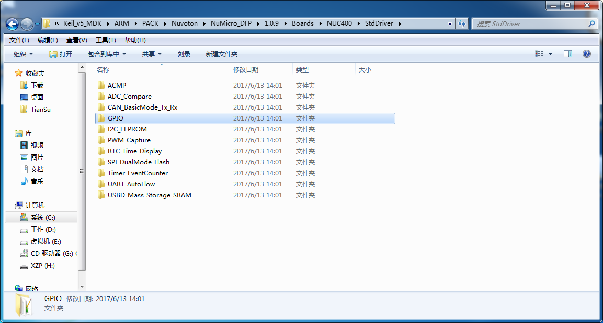

\Keil_v5_MDK\ARM\PACK\Nuvoton\NuMicro_DFP\1.0.9\Device\NUC400路径下3个文件夹为底层驱动文件。

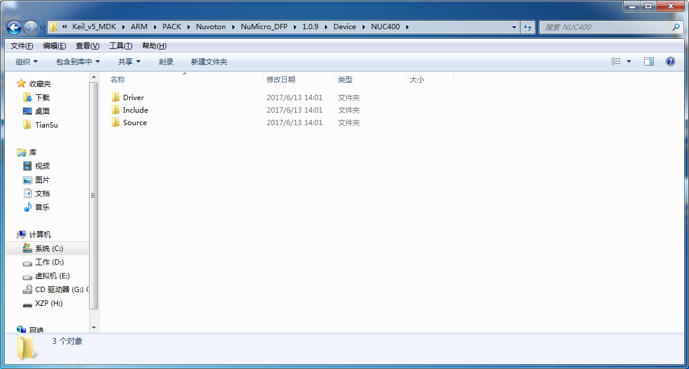

\Keil_v5_MDK\ARM\PACK\ARM\CMSIS\4.5.0\CMSIS\Include为底层驱动包含的系统文件。
 
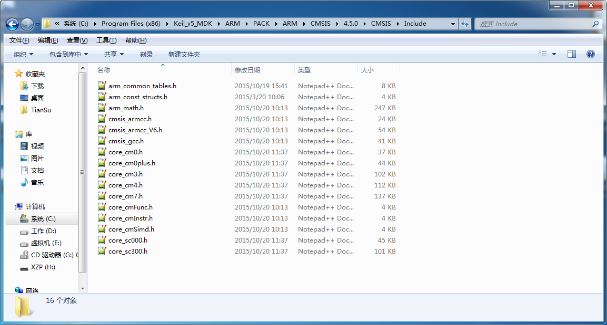

将以上代码都拷到一个文件夹，命名Library。

新建MKD5工程，将驱动拷贝到工程，新建Library目录，添加需要的文件。
 
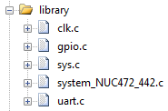

添加启动代码，在\Keil_v5_MDK\ARM\PACK\Nuvoton\NuMicro_DFP\1.0.9\Device\NUC400\Source\ARM文件夹下startup_NUC472_442.s文件

替换LiteOS工程启动文件后，使用中断时不需再使用LiteOS中断注册接口进行注册。

**添加头文件搜索路径**

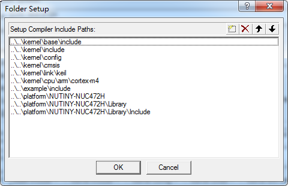

**添加编译宏选项**

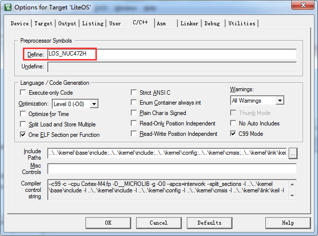

### 代码修改适配

- 修改main文件

在main文件中添加系统时钟初始化，这段代码参考了官方提供的例程

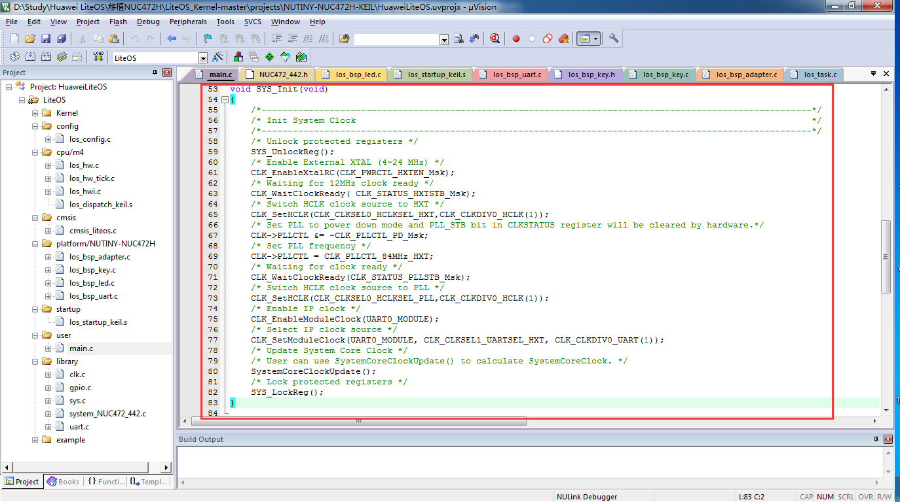
		
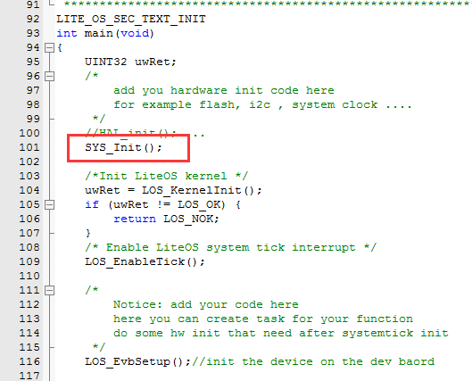

- 修改los_bsp_adapter文件

在此文件中需要提供时钟配置，时钟配置为84MHz

		
- 修改los_bsp_key文件

开发板上没有按键，所以引出一个PH12脚作为按键。配置默认内部上拉，通过和地短接模拟按键。

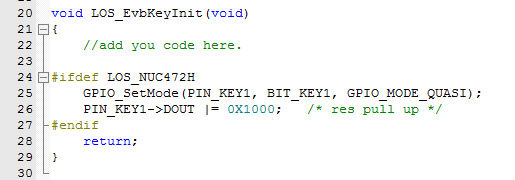

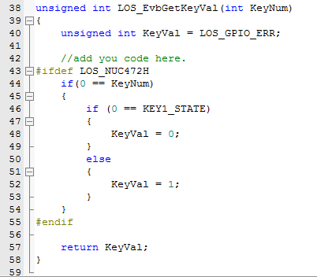

- 修改los_bsp_led文件

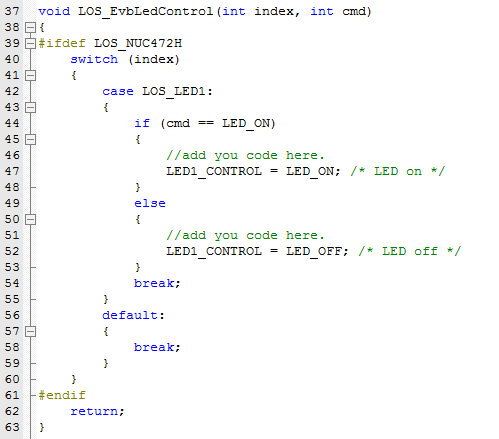

- 修改los_bsp_uart文件

板载的仿真器NU-LINK-ME是V2.0版本，官方说明V3.0版本才加入虚拟串口功能。所以采用引出UART口，外接USB转UART模块的方式打印信息。UART调用底层驱动，实现初始化配置和发送功能。

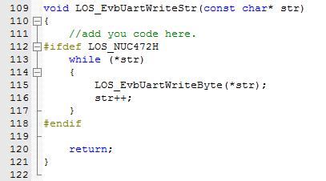

### 编译运行

经过以上步骤，完成了代码的初步移植，接下来可以编译代码,连接串口线（事先安装串口驱动）并在串口调试工具中打开相应串口，设置波特率为115200，调试运行时可看到串口会打印输出内核巡检结果，按下按键，LED点亮，串口输出“Key test example”，松开按键LED熄灭。
打印信息

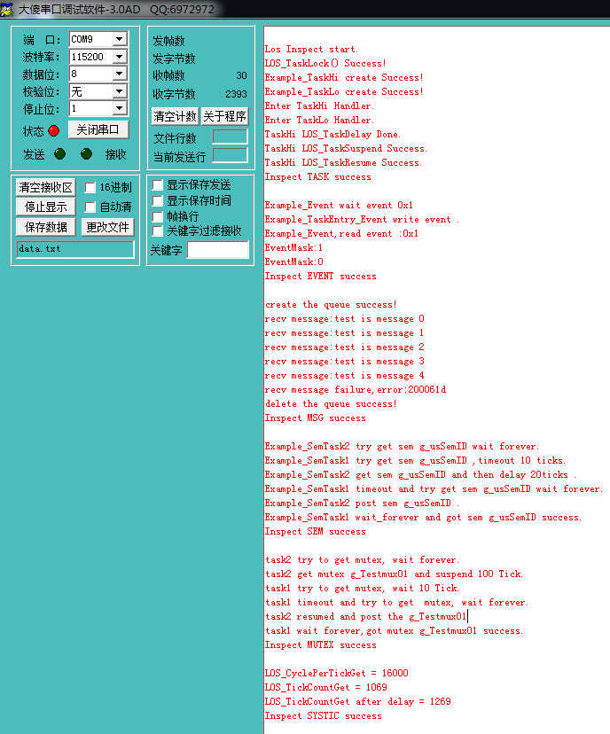

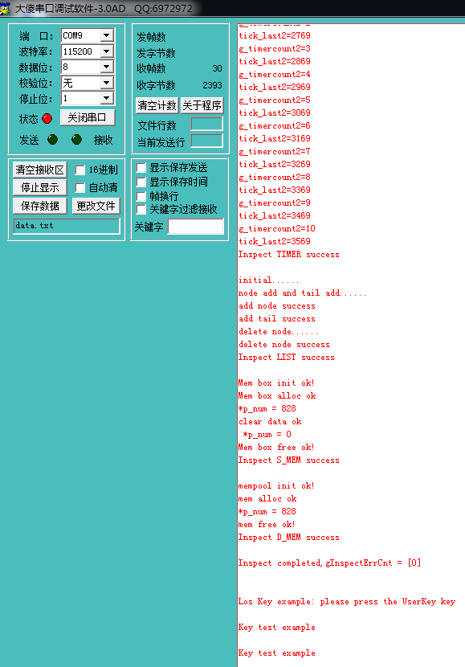

不按按键

 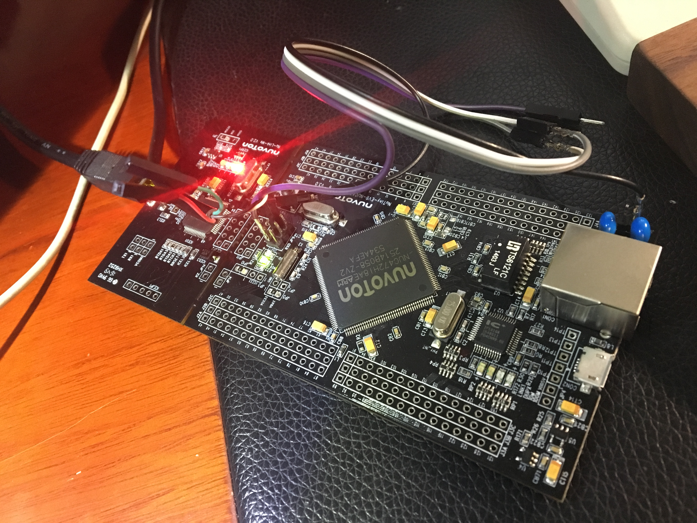
 
按下按键

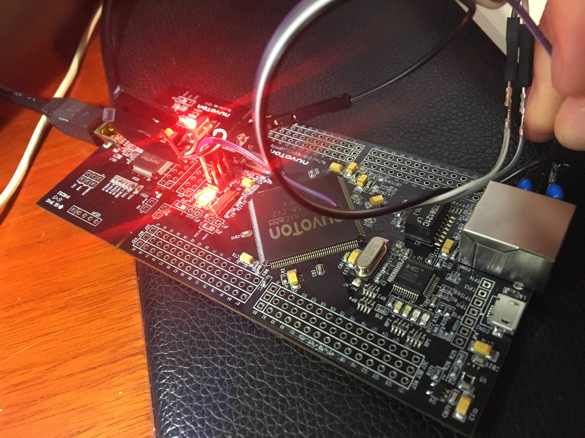

**关于串口输出乱码说明**

部分USB转串口连接后会出现打印乱码的现象，建议更换较短或其他型号的串口线调试。

## 7 其他说明

### 如何使用LiteOS 开发

LiteOS中提供的功能包括如下内容： 任务创建与删除、任务同步（信号量、互斥锁）、动态中断注册机制等等内容，详细内容请参考《HuaweiLiteOSKernelDevGuide》。

### 从零开始创建LiteOS工程

目前在LiteOS的源代码的projects目录下已附带一些开发板的内核示例工程，用户可以直接使用，如果您所使用的开发板（芯片型号）与在示例工程中找不到，您可以从零开始创建LiteOS工程，创建流程请参考《LiteOS_Migration_Guide_Keil》。

### 关于中断向量位置选择

如果您需要使用LiteOS的中断注册机制，详细内容请参考《LiteOS_Migration_Guide_Keil》。

### kernel API测试代码 ###

如果您需要测试LiteOS内核工程运行情况，详细内容请参考《LiteOS_Migration_Guide_Keil》。

