## 1关于本文档的开源协议说明
**您可以自由地：**

**分享** 

- 在任何媒介以任何形式复制、发行本文档

**演绎** 

- 修改、转换或以本文档为基础进行创作。只要你遵守许可协议条款，许可人就无法收回你的这些权利。

**惟须遵守下列条件：**

**署名** 

- 您必须提供适当的证书，提供一个链接到许可证，并指示是否作出更改。您可以以任何合理的方式这样做，但不是以任何方式表明，许可方赞同您或您的使用。

**非商业性使用** 

- 您不得将本作品用于商业目的。

**相同方式共享** 

- 如果您的修改、转换，或以本文档为基础进行创作，仅得依本素材的
授权条款来散布您的贡献作品。

**没有附加限制** 

- 您不能增设法律条款或科技措施，来限制别人依授权条款本已许可的作为。

**声明：**

-  当您使用本素材中属于公众领域的元素，或当法律有例外或限制条款允许您的使用，
则您不需要遵守本授权条款。
未提供保证。本授权条款未必能完全提供您预期用途所需要的所有许可。例如：形象
权、隐私权、著作人格权等其他权利，可能限制您如何使用本素材。

**注意**

- 为了方便用户理解，这是协议的概述. 可以访问网址 https://creativecommons.org/licenses/by-sa/3.0/legalcode 了解完整协议内容.

## 2前言
### 目的

本文档介如何移植Huawei LiteOS到第三方开发板，并成功运行基础示例。

### 读者对象

本文档主要适用于使用Huawei LiteOS Kernel进行开发的开发者。

本文档主要适用于以下对象：

- 物联网端软件开发工程师

- 物联网架构设计师

### 符号约定
在本文中可能出现下列标志，它们所代表的含义如下。

     用于警示紧急的危险情形，若不避免，将会导致人员死亡或严重的人身伤害

    用于警示潜在的危险情形，若不避免，可能会导致人员死亡或严重的人身伤害

    用于警示潜在的危险情形，若不避免，可能会导致中度或轻微的人身伤害

     用于传递设备或环境安全警示信息，若不避免，可能会导致设备损坏、数据丢失、设备性能降低或其它不可预知的结果“注意”不涉及人身伤害

| 说明	|		“说明”不是安全警示信息，不涉及人身、设备及环境伤害信息	|

### 修订记录
修改记录累积了每次文档更新的说明。最新版本的文档包含以前所有文档版本的更新
内容。

<table>
	<tr>
	<td>日期</td>
	<td>修订版本</td>
	<td>描述</td>
	</tr>
	<tr>
	<td>2017年06月20日</td>
	<td>1.0</td>
	<td>完成初稿</td>
	</tr>
    </tr>
    <td>2017年06月22日</td>
	<td>1.1</td>
	<td>根据新增代码及修改代码同步更新</td>
	</tr>
</table>

## 3概述

本文档介绍将Huawei LiteOS内核移植到第三方开发板NANO130KE3BN过程，并成功运行基础示例。

## 4环境准备
基于Huawei LiteOS Kernel开发前，我们首先需要准备好单板运行的环境，包括软件环
境和硬件环境。
硬件环境：

<table>
	<tr>
	<td>所需硬件</td>
	<td>描述</td>
	</tr>
	<tr>
	<td>NUTINY-EVB-NANO130开发板</td>
	<td>基于Cortex-M0内核的芯片开发板</td>
	</tr>
	<tr>
	<td>PC机</td>
	<td>用于编译、加载并调试镜像</td>
	</tr>
	<tr>
	<td>电源</td>
	<td>开发板供电</td>
	</tr>
</table>

软件环境：

<table>
	<tr>
	<td>软件</td>
	<td>描述</td>
	</tr>
	<tr>
	<td>Window 7 操作系统</td>
	<td>安装Keil和相关调试驱动的操作系统</td>
	</tr>
	<tr>
	<td>Keil(5.23.0.0版本)</td>
	<td>用于编译、链接、调试程序代码</td>
	</tr>
	<tr>
	<td>Nu-Link-Me V1.5驱动</td>
	<td>开发板与pc连接的驱动程序，用户加载及调试程序代码</td>
	</tr>
</table>

**说明**

Keil工具需要开发者自行购买，Link驱动程序需根据具体使用的开发板芯片来确定，开发板配套的资料中会提供，或者在使用的芯片官网下载。

## 5获取Huawei LiteOS 源码

首先下载Huawei LiteOS开发包，步骤如下：

- 仓库地址：https://github.com/LITEOS/LiteOS_Kernel.git 

- 点击”clone or download”按钮,下载源代码

- 目录结构如下：

关于代码树中各个目录存放的源代码的相关内容简介如下：

<table>
<tr>
	<td>一级目录</td>
	<td>二级目录</td>
	<td>说明</td>
</tr>
<tr>
	<td>doc</td>
	<td></td>
	<td>此目录存放的是LiteOS的使用文档和API说明文档</td>
</tr>
<tr>
	<td>example</td>
	<td>api</td>
	<td>此目录存放的是内核功能测试用的相关用例的代码</td>
</tr>
<tr>
	<td></td>
	<td>include</td>
	<td>aip功能头文件存放目录</td>
</tr>
<tr>
	<td>kernel</td>
	<td>base</td>
	<td>此目录存放的是与平台无关的内核代码，包含核心提供给外部调用的接口的头文件以及内核中进程调度、进程通信、内存管理等等功能的核心代码。用户一般不需要修改此目录下的相关内容。</td>
</tr>
<tr>
	<td></td>
	<td>cmsis</td>
	<td>LiteOS提供的cmsis接口</td>
</tr>
<tr>
	<td></td>
	<td>config</td>
	<td>此目录下是内核资源配置相关的代码，在头文件中配置了LiteOS所提供的各种资源所占用的内存池的总大小以及各种资源的数量，例如task的最大个数、信号量的最大个数等等</td>
</tr>
<tr>
	<td></td>
	<td>cpu</td>
	<td>此目录以及以下目录存放的是与体系架构紧密相关的适配LiteOS的代码。比如目前我们适配了arm/cortex-m4及arm/cortex-m3系列对应的初始化内容。</td>
</tr>
<tr>
	<td></td>
	<td>include</td>
	<td>内核的相关头文件存放目录</td>
</tr>
<tr>
	<td></td>
	<td>link</td>
	<td>与IDE相关的编译链接相关宏定义</td>
</tr>
<tr>
	<td>platform</td>
	<td>GD32F190R-EVAL</td>
	<td>GD190开发板systick以及led、uart、key驱动bsp适配代码</td>
</tr>
<tr>
	<td></td>
	<td>GD32F450i-EVAL</td>
	<td>GD450开发板systick以及led、uart、key驱动bsp适配代码</td>
</tr>
<tr>
	<td></td>
	<td>STM32F412ZG-NUCLEO</td>
	<td>STM32F412开发板systick以及led、uart、key驱动bsp适配代码</td>
</tr>
<tr>
	<td></td>
	<td>STM32F429I_DISCO</td>
	<td>STM32F429开发板systick以及led、uart、key驱动bsp适配代码</td>
</tr>
<tr>
	<td></td>
	<td>STM32L476RG_NUCLEO</td>
	<td>STM32L476开发板systick以及led、uart、key驱动bsp适配代码</td>
</tr>
<tr>
	<td></td>
	<td>LPC824_LITE</td>
	<td>LPC824Lite开发板systick及驱动相关代码</td>
</tr>
<tr>
	<td></td>
	<td>LPC54110_BOARD</td>
	<td>LPC54110开发板systick及驱动相关代码</td>
</tr>
<tr>
	<td></td>
	<td>MM32F103_MINI</td>
	<td>MM32F103开发板systick及驱动相关代码</td>
</tr>
<tr>
	<td></td>
	<td>STM32F746ZG_NUCLEO</td>
	<td>STM32F746ZG开发板systick以及led、uart、key驱动bsp适配代码</td>
</tr>
<tr>
	<td></td>
	<td>LOS_EXPAND_XXX</td>
	<td>用于新扩展的开发板systick以及led、uart、key驱动bsp适配代码</td>
</tr>
<tr>
	<td>projects</td>
	<td>STM32F412ZG-NUCLEO-KEIL</td>
	<td>stm32f412开发板的keil工程目录</td>
</tr>
<tr>
	<td></td>
	<td>STM32F429I_DISCO_IAR</td>
	<td>stm32f429开发板的iar工程目录</td>
</tr>
<tr>
	<td></td>
	<td>STM32F429I_DISCO_KEIL</td>
	<td>stm32f429开发板的keil工程目录</td>
</tr>
<tr>
	<td></td>
	<td>STM32L476R-NUCLEO-KEIL</td>
	<td>stm32l476开发板的keil工程目录</td>
</tr>
<tr>
	<td></td>
	<td>GD32F190R-EVAL-KEIL</td>
	<td>gd32f190开发板的keil工程目录</td>
</tr>
<tr>
	<td></td>
	<td>GD32F450i-EVAL-KEIL</td>
	<td>gd32f450开发板的keil工程目录</td>
</tr>
<tr>
	<td></td>
	<td>LPC824_LITE_KEIL</td>
	<td>lpc824Lite开发板的keil工程目录</td>
</tr>
<tr>
	<td></td>
	<td>LPC54110_BOARD_KEIL</td>
	<td>lpc54110开发板的keil工程目录</td>
</tr>
<tr>
	<td></td>
	<td>MM32F103_MINI_KEIL</td>
	<td>MindMotion MM32 MiniBoard开发板的keil工程目录</td>
</tr>
<tr>
	<td></td>
	<td>STM32F746ZG-NUCLEO-KEIL</td>
	<td>NUCLEO-F746ZG 开发板的keil工程目录</td>
</tr>
<tr>
	<td>user</td>
	<td></td>
	<td>此目录存放用户测试代码，LiteOS的初始化和使用示例在main.c文件中</td>
</tr>
</table>

获取Huawei LiteOS源代码之后，我们就可以开始创建自己的project开发工程了，详细内容请参考后续各章节。

## 6如何适配LiteOS内核工程开发

### 获取并安装NANO130KE3BN软件开发包
- 获取NANO130KE3BN的BSP开发包及Nu-Link_Keil_Drive驱动包，链接：http://www.nuvoton.com.cn/hq/products/microcontrollers/arm-cortex-m0-mcus/nano130-advanced-series/nano130ke3bn/?__locale=en，点图中红色框中按钮下载。解压并安装即可。

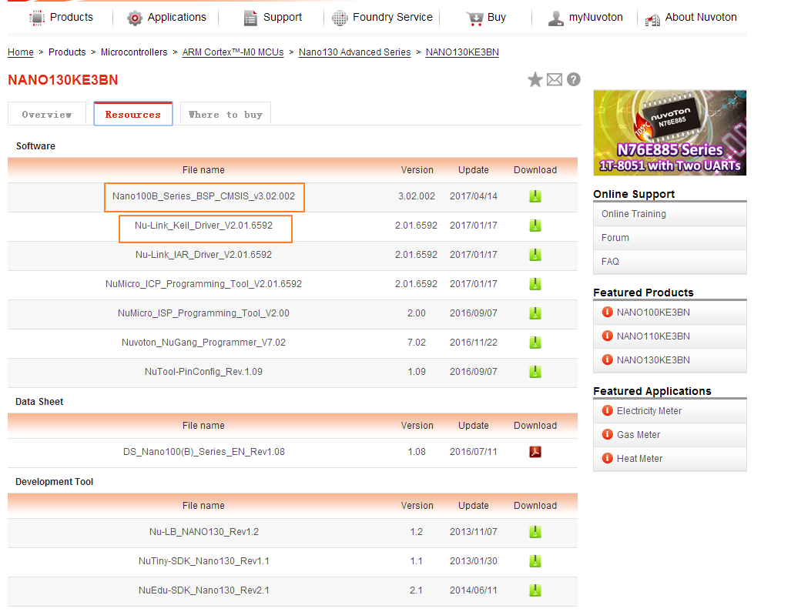

- 获取NANO130KE3BN的Keil支持包，链接：http://www.keil.com/dd2/nuvoton/nano130ke3bn/，点图中红色框中按钮下载。点击下载的文件安装即可。

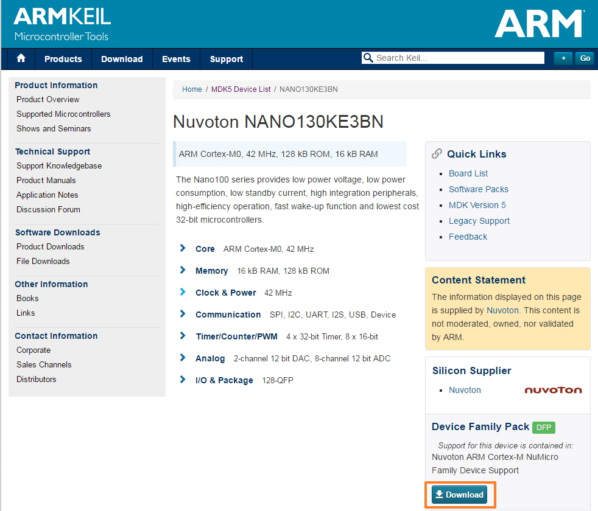

### 6.1 创建工程

- 获取到LiteOS内核代码后，重命名目录platform\LOS_EXPAND_XXX为platform\NuTiny-Nano130K。
- 解压下载的文件Nano100B_Series_BSP_CMSIS_v3.02.002.zip，将Nano100B_Series_BSP_CMSIS_v3.02.002/Library/StdDriver/下的文件拷贝到LiteOS_Kernel\platform\NuTiny-Nano130K目录下，以便添加到工程中。

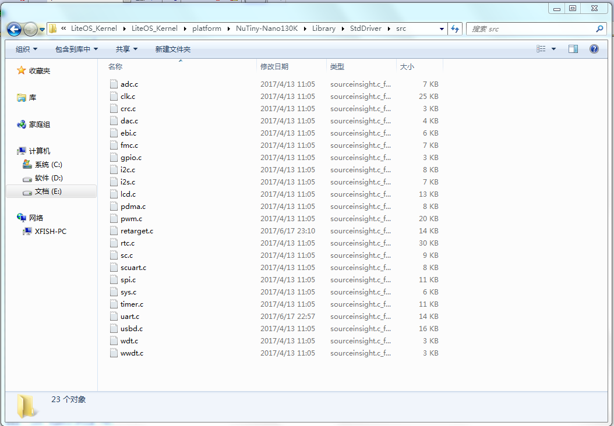

在安装好Keil等开发工具后，我们使用Keil集成开发环境创建Huawei LiteOS工程，步骤如下：

- 打开Keil uVision5， 然后点击project->New uVision Project...创建一个新的工程

- 新建保存工程的文件夹LiteOS_Kernel\projects\NuTiny-Nano130K-KEIL,保存工程名HuaweiLiteOS

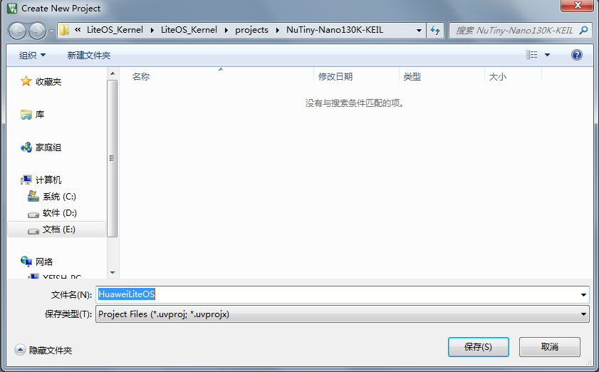

- 保存后会立即弹出芯片型号选择的窗口，选择NANO130KE3BN芯片。
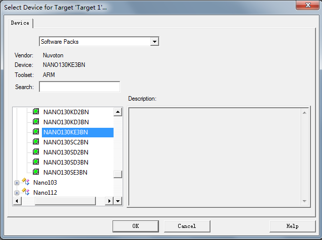

- 然后选择要包含的开发基础库CMSIS、DEVICE,这两个选项包含平台提供的支持包和启动汇编文件,选择"OK"。

至此，我们的工程已经创建完成，如下图所示：

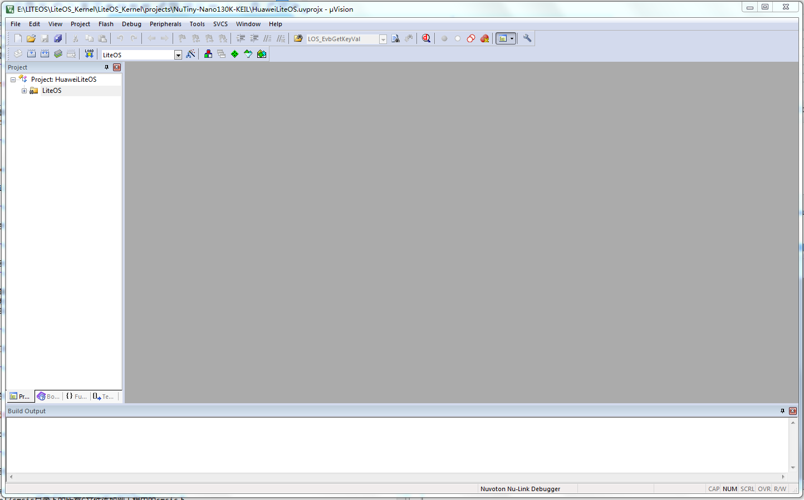

完成上面的芯片和支持包选择之后，可以将内核源代码添加到工程中。

### 6.2 添加kernel代码到工程

- 创建LiteOS的相关目录层级

创建完成目录树之后我们添加源代码到目录树中，最终添加完成的内容如下：

- 将kernel/base目录下的所有C文件添加到工程中的kernel下
- 将kernel/cmsis目录下的所有C文件添加到工程中的cmsis下。
- 将platform\NuTiny-Nano130K目录下的所有C文件添加到工程中的platform/NuTiny-Nano130K下
- 根据芯片内核型号，将kernel\cpu\arm\cortex-m0目录下的所有C文件以及汇编代码添加到工程中的cpu/m0下
- 将kernel\config目录下的所有C文件添加到工程中的config下
- 将user目录下的所有C文件添加到工程中的user下
- 将\platform\NuTiny-Nano130K\Library目录下的驱动文件添加到工程的library目录下
- 添加example/api目录下的所有C文件到工程的example目录下

完成代码添加后的工程目录如下图

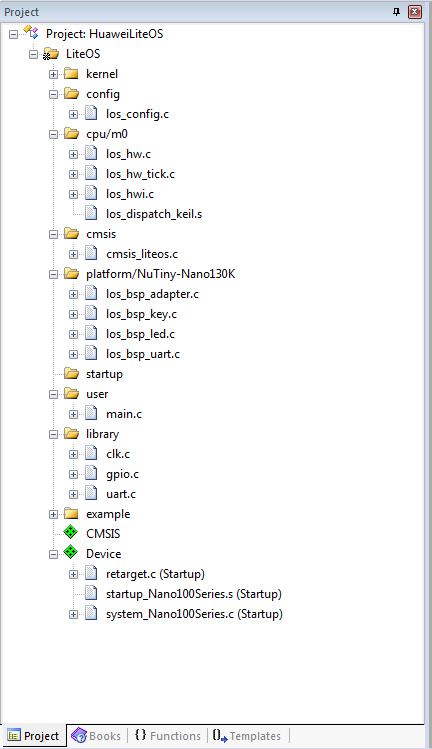

### 6.3 配置工程属性

- 配置target，如果需要调试log输出（printf）到IDE，可以选择Use MicroLib。

- 编译C/C++设置中勾选C99选项,由于板子的RAM只有16M,需要添加宏RAM_SIZE_LEVEL_1。

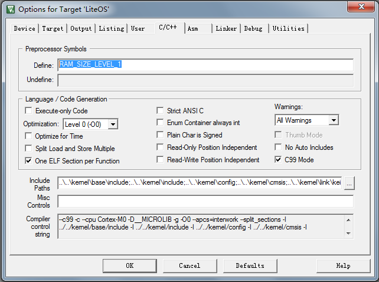

- 配置头文件搜索路径,可参考图片中所示内容

..\..\kernel\base\include;

..\..\kernel\include;

..\..\kernel\config;

..\..\kernel\cmsis;

..\..\kernel\link\keil;

..\..\kernel\cpu\arm\cortex-m0;

..\..\example\include;

..\..\platform\NuTiny-Nano130K;

..\..\platform\NuTiny-Nano130K\Library\StdDriver\inc;

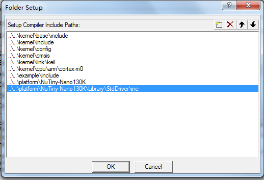

- 配置debug使用的驱动，选择Nuvoton Nu-link Debugger,其他保持默认配置。

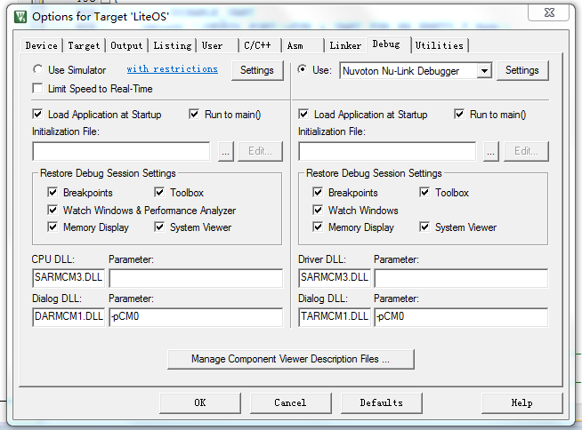

## 7 适配驱动代码

- 空函数的具体实现可参考源码中已适配的其他工程中同名的文件，如有其他需要增加的驱动功能，可以在同级目录下添加相关文件。
- 依据板子的pcb和bsp软件包适配驱动，板子的pcb如下，
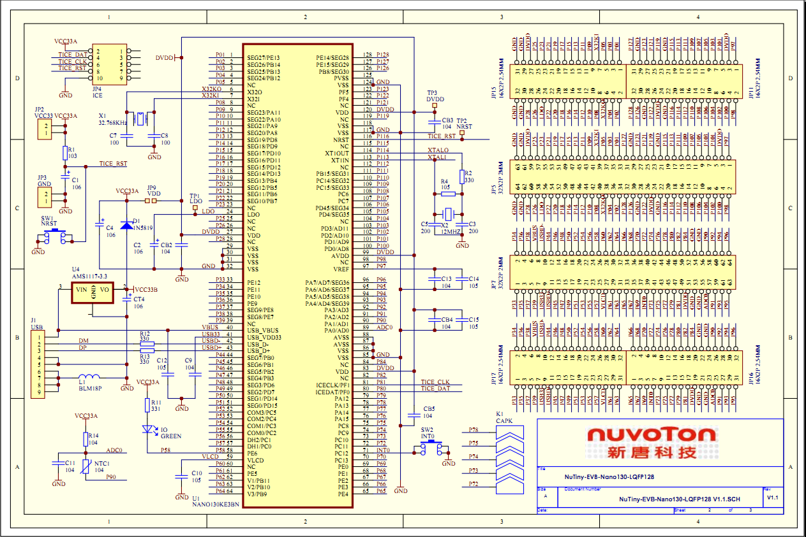
- 
- 适配时钟及多功能引脚复用
（1） 系统初始化函数如下

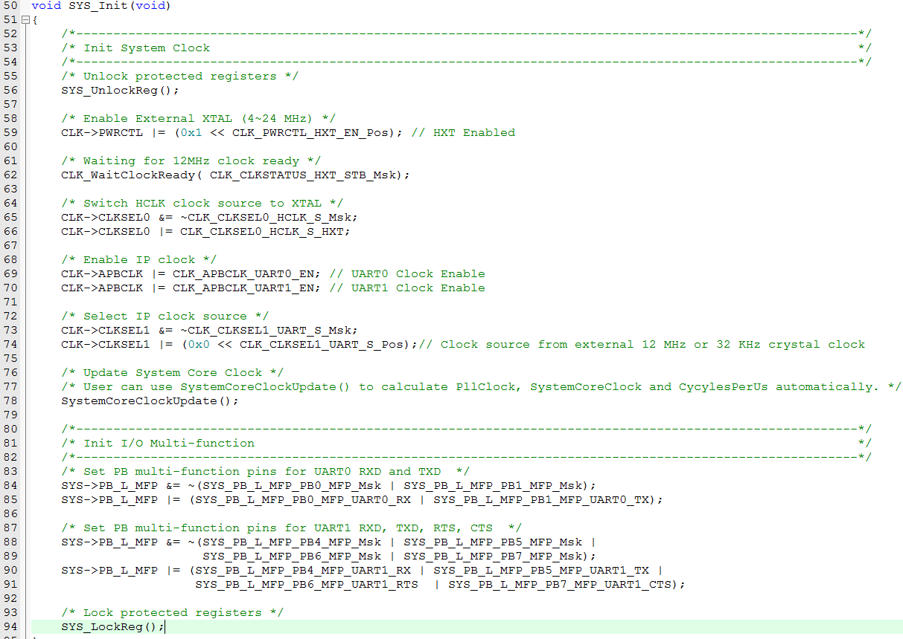

(2) 出于省电的考虑，Nano130K的所有IP时钟都在系统时钟起阵之后才会起阵。所以在main()函数中要首先执行SYS_init（）函数。

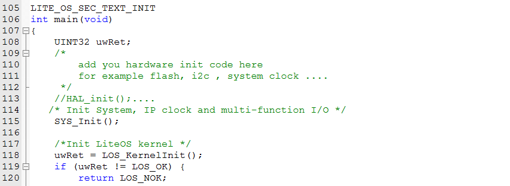

- 适配串口驱动

通过LOS借口函数实现串口打印。使用UART0，UART0的RX和TX为板子的44号和45号脚，需要使用TTL转232.接线图如下，

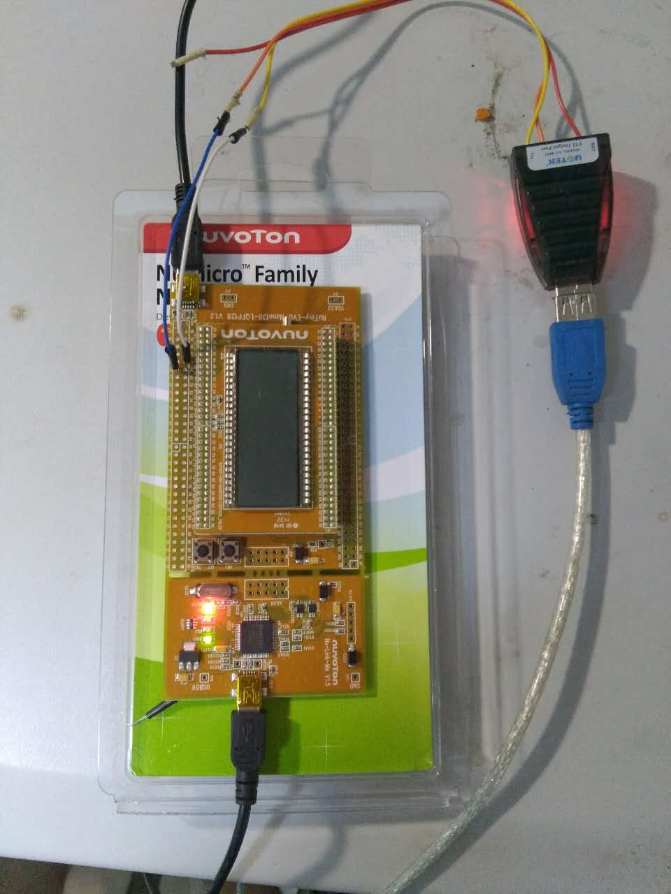
 
（1） 注释掉retarget.c中fputc函数；
 
（2） 添加UART0初始化代码：

 
（3） printf通过fputc()函数实现串口重定向，los_bsp_uart.c的fputc()通过调用LOS_EvbUartWriteByte((char)ch)，实现这个函数，即可实现串口打印。

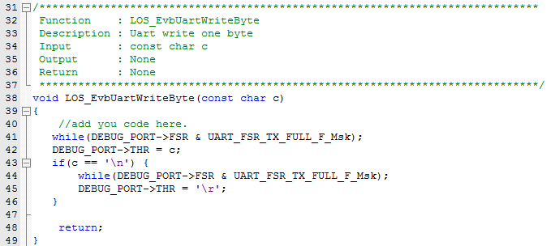

（4） 设置串口工具波特率为115200，执行程序会有输出打印。

- 适配按键驱动
查看板子的PCB可以发现，留给用户可以自定义使用的只有一个按钮，接在PC12引脚，即板子上71号脚。

（1） 初始化PC12引脚为GPIO输入脚：

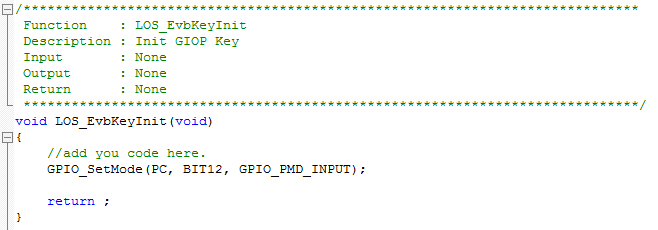

 (2) 实现获取按键值函数如下：

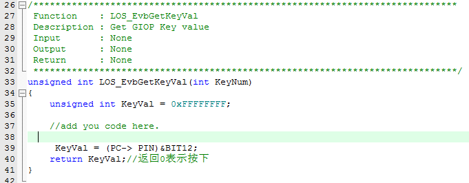
 
- 适配LED驱动
LED使用PA0引脚，接线图如下：

（1）初始化PA0为GPIO输出脚

（2） 通过设置PA0的值实现点灯关灯函数

## 8验证移植后的工程

如果您需要验证移植后的LiteOS内核功能，可以参考本章内容。

### 8.1 搭建验证环境如下：

依据移植过程的设定，44脚与45脚与串口的RX和TX连接。PA0接LED等，Nu-Link_Me接PC,如下图所示。

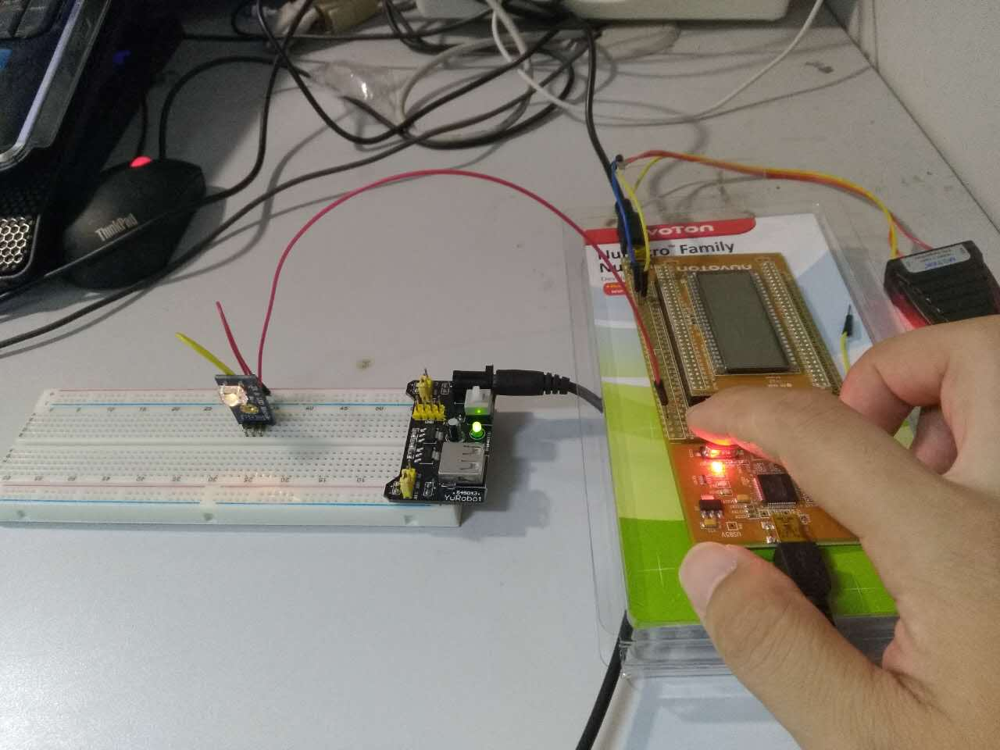

### 8.2 API测试代码使用

执行验证示例代码如下：

    extern void LOS_Demo_Entry(void)；
    int main(void)
    {
        UINT32 uwRet;
        /*
    		add you hardware init code here
    		for example flash, i2c , system clock ....
        */
    	//HAL_init();....
        SYS_Init();
    	
    	/*Init LiteOS kernel */
        uwRet = LOS_KernelInit();
        if (uwRet != LOS_OK) {
            return LOS_NOK;
        }
    	/* Enable LiteOS system tick interrupt */
        LOS_EnableTick();
    	
        /* 
            Notice: add your code here
            here you can create task for your function 
            do some hw init that need after systemtick init
        */
        LOS_EvbSetup(); 
    
        LOS_Demo_Entry();	
        
        LOS_Inspect_Entry();
        
    	//LOS_BoadExampleEntry();	
    		
        /* Kernel start to run */
        LOS_Start();
        for (;;);
        /* Replace the dots (...) with your own code.  */
    }

### 输出结果
编译执行程序，按下按键，LED亮，松开按钮，LED灭。整个过程串口输出如下：

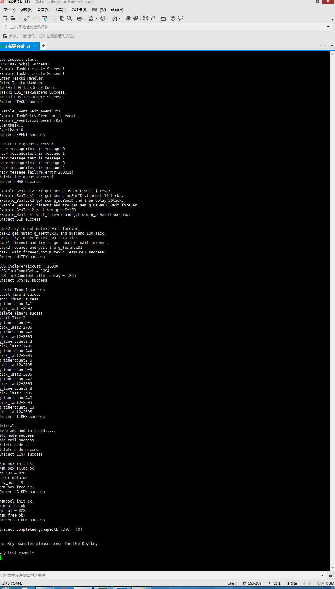

## 9 其他说明

- Nano130K的RAM较小，只有16M，请参照los_config.h文件中的注释，在工程中定义相关的编译宏，否则会出现编译失败（RAM大于32k可不定义）。

		/* default LiteOS ram size level 
			RAM_SIZE_LEVEL_0 means kernel ram < 8k  , 
			RAM_SIZE_LEVEL_1 means kernel ram < 16k, 
			RAM_SIZE_LEVEL_2 means means kernel ram>=32k 
		*/

###如何使用LiteOS 开发###

LiteOS中提供的功能包括如下内容： 任务创建与删除、任务同步（信号量、互斥锁）、动态中断注册机制等等内容，详细内容请参考《HuaweiLiteOSKernelDevGuide》。

###从零开始创建LiteOS工程###

目前在LiteOS的源代码的projects目录下已附带一些开发板的内核示例工程，用户可以直接使用，如果您所使用的开发板（芯片型号）与在示例工程中找不到，您可以从零开始创建LiteOS工程，创建流程请参考《LiteOS_Migration_Guide_Keil》。

###关于中断向量位置选择###

如果您需要使用LiteOS的中断注册机制，详细内容请参考《LiteOS_Migration_Guide_Keil》。

### kernel API测试代码 ###

如果您需要测试LiteOS内核工程运行情况，详细内容请参考《LiteOS_Migration_Guide_Keil》。

