## 1关于本文档的开源协议说明
**您可以自由地：**

**分享** 

- 在任何媒介以任何形式复制、发行本文档

**演绎** 

- 修改、转换或以本文档为基础进行创作。只要你遵守许可协议条款，许可人就无法收回你的这些权利。

**惟须遵守下列条件：**

**署名** 

- 您必须提供适当的证书，提供一个链接到许可证，并指示是否作出更改。您可以以任何合理的方式这样做，但不是以任何方式表明，许可方赞同您或您的使用。

**非商业性使用** 

- 您不得将本作品用于商业目的。

**相同方式共享** 

- 如果您的修改、转换，或以本文档为基础进行创作，仅得依本素材的
授权条款来散布您的贡献作品。

**没有附加限制** 

- 您不能增设法律条款或科技措施，来限制别人依授权条款本已许可的作为。

**声明：**

-  当您使用本素材中属于公众领域的元素，或当法律有例外或限制条款允许您的使用，
则您不需要遵守本授权条款。
未提供保证。本授权条款未必能完全提供您预期用途所需要的所有许可。例如：形象
权、隐私权、著作人格权等其他权利，可能限制您如何使用本素材。

**注意**

- 为了方便用户理解，这是协议的概述. 可以访问网址 https://creativecommons.org/licenses/by-sa/3.0/legalcode 了解完整协议内容.

## 2前言
### 目的

本文档介绍基于Huawei LiteOS如何移植到第三方开发板，并成功运行基础示例。

### 读者对象

本文档主要适用于Huawei LiteOS Kernel的开发者。
本文档主要适用于以下对象：

- 物联网端软件开发工程师

- 物联网架构设计师

### 符号约定
在本文中可能出现下列标志，它们所代表的含义如下。

     用于警示紧急的危险情形，若不避免，将会导致人员死亡或严重的人身伤害

    用于警示潜在的危险情形，若不避免，可能会导致人员死亡或严重的人身伤害

    用于警示潜在的危险情形，若不避免，可能会导致中度或轻微的人身伤害

     用于传递设备或环境安全警示信息，若不避免，可能会导致设备损坏、数据丢失、设备性能降低或其它不可预知的结果“注意”不涉及人身伤害

| 说明	|		“说明”不是安全警示信息，不涉及人身、设备及环境伤害信息	|				

### 修订记录
修改记录累积了每次文档更新的说明。最新版本的文档包含以前所有文档版本的更新
内容。

<table>
	<tr>
	<td>日期</td>
	<td>修订版本</td>
	<td>描述</td>
	</tr>
	<tr>
	<td>2017年01月17日</td>
	<td>1.0</td>
	<td>完成初稿</td>
	</tr>
</table>

## 3概述

目前在github上已开源的Huawei LiteOS内核源码已适配好STM32F429芯片，本手册将以STM32F429ZI芯片为例，介绍基于Cortex M4核芯片的移植过程。

## 4环境准备
基于Huawei LiteOS Kernel开发前，我们首先需要准备好单板运行的环境，包括软件环
境和硬件环境。
硬件环境：
<table>
	<tr>
	<td>所需硬件</td>
	<td>描述</td>
	</tr>
	<tr>
	<td>STM32F4291-DISCO单板</td>
	<td>STM32开发板(芯片型号STM32F429ZIT6)</td>
	</tr>
	<tr>
	<td>PC机</td>
	<td>用于编译、加载并调试镜像</td>
	</tr>
	<tr>
	<td>电源（5v）</td>
	<td>开发板供电(使用Mini USB连接线)</td>
	</tr>
</table>

软件环境：
<table>
	<tr>
	<td>软件</td>
	<td>描述</td>
	</tr>
	<tr>
	<td>Window 7 操作系</td>
	<td>安装IAR和st-link的操作系统</td>
	</tr>
	<tr>
	<td>IAR(7.30以上版本)</td>
	<td>用于编译、链接、调试程序代码</td>
	</tr>
	<tr>
	<td>st-link_v2_usbdriver</td>
	<td>开发板与pc连接的驱动程序，用户加载及调试程序代码</td>
	</tr>
</table>

**说明**

IAR工具需要开发者自行购买，ST-Link的驱动程序可以从st link的相关网站获取，采用J-Link还
是ST-Link需要根据具体使用的开发板来确定。这里以STM32F429为例，使用ST-Link。

## 5获取Huawei LiteOS 源码

首先我们需要通过网络下载获取Huawei LiteOS开发包。目前Huawei LiteOS的代码已经
开源，可以直接从网络上获取，步骤如下：

- 直接到github上面clone。仓库地址是https://github.com/LITEOS/LiteOS_Kernel.git

- 从github上获取的代码，则目录结构如下：

关于代码树中各个目录存放的源代码的相关内容简介如下：

<table>
<tr>
	<td>一级目录</td>
	<td>二级目录</td>
	<td>说明</td>
</tr>
<tr>
	<td>doc</td>
	<td></td>
	<td>此目录存放的是LiteOS的使用文档和API说明文档</td>
</tr>
<tr>
	<td>example</td>
	<td>api</td>
	<td>此目录存放的是内核功能测试用的相关用例的代码</td>
</tr>
<tr>
	<td></td>
	<td>include</td>
	<td>aip功能头文件存放目录</td>
</tr>
<tr>
	<td>kernel</td>
	<td>base</td>
	<td>此目录存放的是与平台无关的内核代码，包含核心提供给外部调用的接口的头文件以及内核中进程调度、进程通信、内存管理等等功能的核心代码。用户一般不需要修改此目录下的相关内容。</td>
</tr>
<tr>
	<td></td>
	<td>cmsis</td>
	<td>LiteOS提供的cmsis接口</td>
</tr>
<tr>
	<td></td>
	<td>config</td>
	<td>此目录下是内核资源配置相关的代码，在头文件中配置了LiteOS所提供的各种资源所占用的内存池的总大小以及各种资源的数量，例如task的最大个数、信号量的最大个数等等</td>
</tr>
<tr>
	<td></td>
	<td>cpu</td>
	<td>此目录以及以下目录存放的是与体系架构紧密相关的适配LiteOS的代码。比如目前我们适配了arm/cortex-m4及arm/cortex-m3系列对应的初始化内容。</td>
</tr>
<tr>
	<td></td>
	<td>include</td>
	<td>内核的相关头文件存放目录</td>
</tr>
<tr>
	<td></td>
	<td>link</td>
	<td>与IDE相关的编译链接相关宏定义</td>
</tr>
<tr>
	<td>platform</td>
	<td>GD32F190R-EVAL</td>
	<td>GD190开发板systick以及led、uart、key驱动bsp适配代码</td>
</tr>
<tr>
	<td></td>
	<td>GD32F450i-EVAL</td>
	<td>GD450开发板systick以及led、uart、key驱动bsp适配代码</td>
</tr>
<tr>
	<td></td>
	<td>STM32F412ZG-NUCLEO</td>
	<td>STM32F412开发板systick以及led、uart、key驱动bsp适配代码</td>
</tr>
<tr>
	<td></td>
	<td>STM32F429I_DISCO</td>
	<td>STM32F429开发板systick以及led、uart、key驱动bsp适配代码</td>
</tr>
<tr>
	<td></td>
	<td>STM32L476RG_NUCLEO</td>
	<td>STM32L476开发板systick以及led、uart、key驱动bsp适配代码</td>
</tr>
<tr>
	<td>projects</td>
	<td>STM32F412ZG-NUCLEO-KEIL</td>
	<td>stm32f412开发板的keil工程目录</td>
</tr>
<tr>
	<td></td>
	<td>STM32F429I_DISCO_IAR</td>
	<td>stm32f429开发板的iar工程目录</td>
</tr>
<tr>
	<td></td>
	<td>STM32F429I_DISCO_KEIL</td>
	<td>stm32f429开发板的keil工程目录</td>
</tr>
<tr>
	<td></td>
	<td>STM32L476R-Nucleo</td>
	<td>stm32f476开发板的keil工程目录</td>
</tr>
<tr>
	<td></td>
	<td>GD32F190R-EVAL-KEIL</td>
	<td>gd32f190开发板的keil工程目录</td>
</tr>
<tr>
	<td></td>
	<td>GD32F450i-EVAL-KEIL</td>
	<td>gd32f450开发板的keil工程目录</td>
</tr>
<tr>
	<td>user</td>
	<td></td>
	<td>此目录存放用户测试代码，LiteOS的初始化和使用示例在main.c中</td>
</tr>
</table>

获取Huawei LiteOS源代码之后，我们就可以创建project然后编译调试我们的程序了，
详细可以参考后续的各个章节。详细的编程应用编程API请参考《HuaweiLiteOSKernelDevGuide》

## 6创建Huawei LiteOS 工程

在获取完成Huawei LiteOS的源代码和安装好IAR等相关的开发工具后，我们需要用IAR
集成开发环境创建编译Huawei LiteOS的工程，步骤如下：

- 打开IAR， 然后点击File->New->Workspace创建一个新的工作空间

- 然后点击Project->Create New Project...创建一个新的project

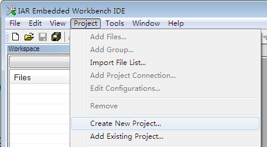
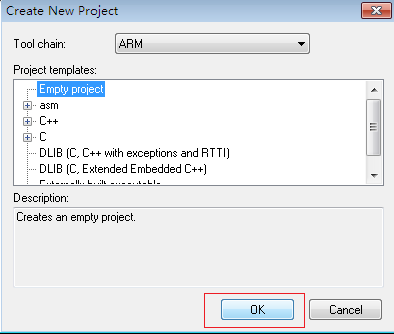

    创建一个空的工程

- 保存工程名，比如HuaweiLiteOS

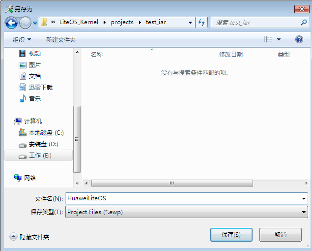

- 创建工程中的目录结构

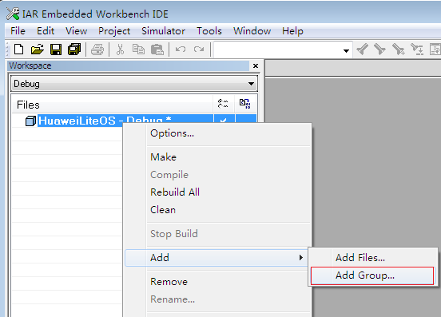

如上图所示，通过add Group 操作来创建一个在工程中显示的目录树，方便我们区分代码功能，比如我们创建如下结构的目录树

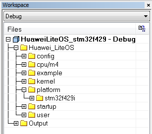

- 将kernel/base目录下的所有C代码添加到工程中的kernel下
- 将kernel/cmsis目录下的所有C代码添加到工程中的cmsis下。
- 将platform\STM32F429I_DISCO目录下的所有C代码添加到工程中的platform/stm32f429i下
- 将kernel\cpu\arm\cortex-m4目录下的所有C代码以及汇编代码添加到工程中的cpu/m4下
- 将kernel\config目录下的所有C代码添加到工程中的config下
- 将user目录下的所有C代码添加到工程中的user下
- 将platform\STM32F429I_DISCO目录下keil版本的startup汇编代码添加到工程中的startup下

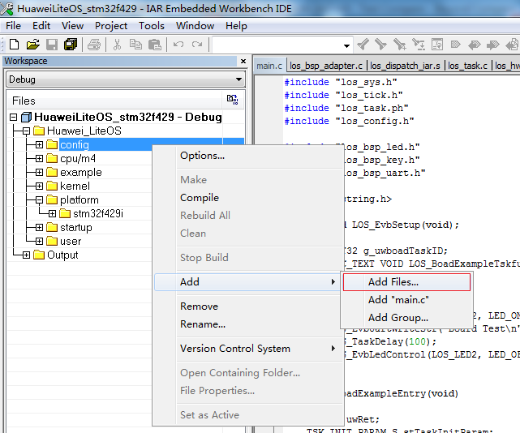
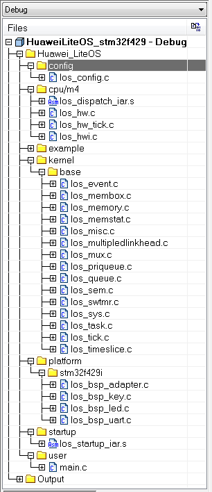

- 完成上面内容后我们先保存一下

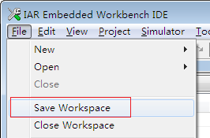
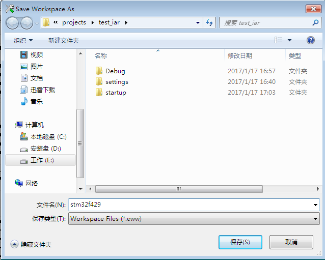

- 完成添加文件之后，需要对工程进行详细的配置，配置内容步骤如下所示：

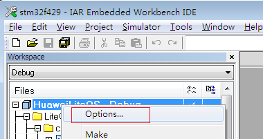

- 配置芯片型号

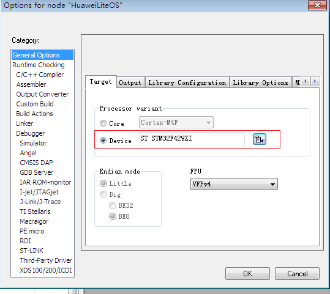

- 配置C编译选项，使用C99语法

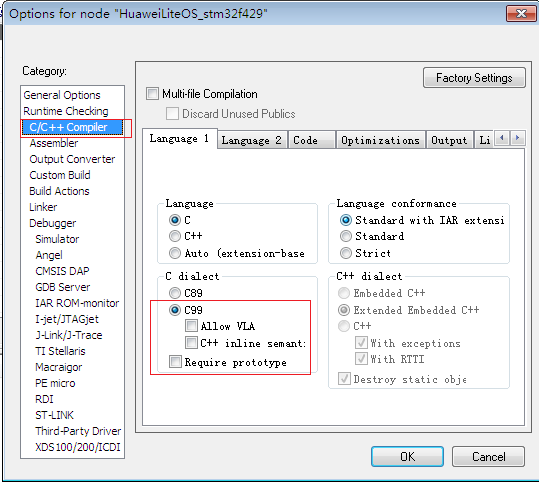

- 配置C文件头文件搜索路径，需要将所有的头文件路径都包含进来

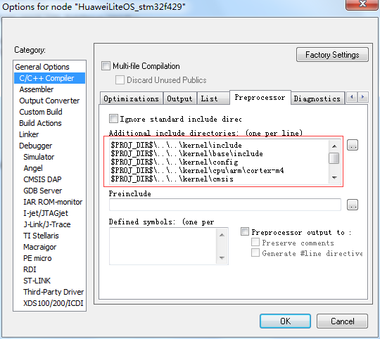
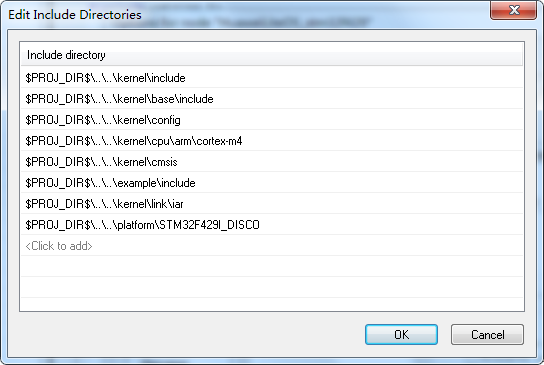

- 配置分散加载文件

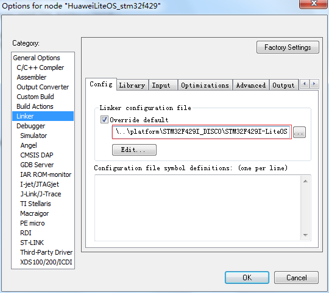

说明：分散配置文件中增加的是vector（中断向量表）的内容，LiteOS的中断向量表在stm32f429ZI这个芯片中定义的是0x400大小。如果不了解分散加载文件可以参考IDE的help中sct文件的说明。或者baidu、google分散加载文件相关内容。

- 配置debug相关选项，是stm32f429开发板中使用ST-Link

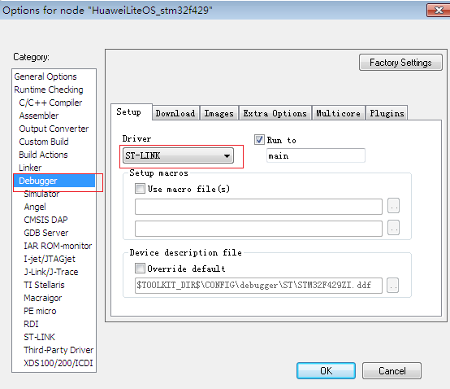
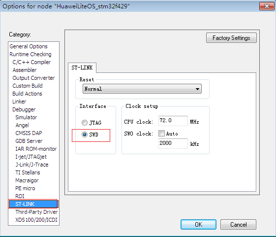

说明：los_dispatch.s、los_vendor.s这个文件在git上的代码时放在projects/stm32f429_keil/startup目录下的，如果是iar工程则是在projects/stm32f429_iar/startup目录下。他们因为工具不同所以汇编文件语法有些不一样。

### kernel API测试代码

如果需要测试LiteOS是否正常运行，可以将example/api添加到工程目录中。

### 测试代码使用

测试代码入口是los_demo_entry.c中的LOS_Demo_Entry()这个接口，使用方法los_config.c的main中调用

示例如下：

	extern void LOS_Demo_Entry(void)；
	int main(void)
	{
	    UINT32 uwRet;
	    /*
				add you hardware init code here
				for example flash, i2c , system clock ....
	    */
		//HAL_init();....
		
		/*Init LiteOS kernel */
	    uwRet = LOS_KernelInit();
	    if (uwRet != LOS_OK) {
	        return LOS_NOK;
	    }
			/* Enable LiteOS system tick interrupt */
	    LOS_EnableTick();
			
			
	    /* 
	        Notice: add your code here
	        here you can create task for your function 
	        do some hw init that need after systemtick init
	    */
	    //LOS_EvbSetup();
	    //LOS_BoadExampleEntry();
		
		LOS_Demo_Entry()；	
	    /* Kernel start to run */
	    LOS_Start();
	    for (;;);
	    /* Replace the dots (...) with your own code.  */
	}

**如何选择测试的功能：**

- 在example/include/los_demo_entry.h 打开要测试的功能的宏开关LOS_KERNEL_TEST_xxx，比如测试task调度打开 LOS_KERNEL_TEST_TASK 即可（//#define LOS_KERNEL_TEST_TASK 修改为 #define LOS_KERNEL_TEST_TASK）。

- 如果需要printf，并且是Keil工程，则将los_demo_debug.h中的LOS_KERNEL_DEBUG_OUT、LOS_KERNEL_TEST_KEIL_SWSIMU打开。目前文档描述的是在IAR工程中，所以不需要打开LOS_KERNEL_TEST_KEIL_SWSIMU。

- 中断测试无法在软件仿真的情况下测试。

**使用printf打印可以有几种方法**

- 将printf重定位到uart输出，这个需要uart驱动支持，如果只有liteOS而没有相关驱动加入工程则不建议使用该方法。
- 在IAR中直接可以在调试窗口看到printf的log输出。

## 7编译调试
打开工程后，菜单栏Project→Clean 、Rebuild All，可clean和build 文件。这里点
击Rebuild All，编译全部文件

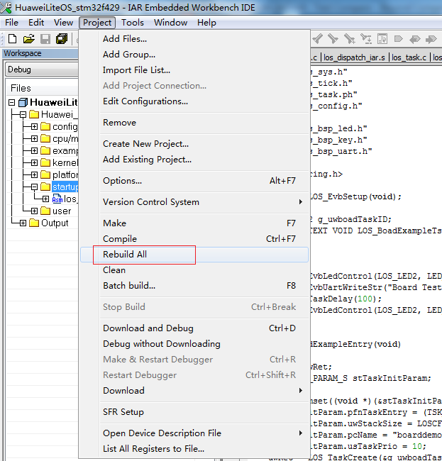

**关于中断向量位置选择**

- 在los_bsp_adapter.c中，g_use_ram_vect变量控制了LiteOS中是否使用vector向量表（中断向量表）重定向功能。如果g_use_ram_vect设置为 1 ，则需要在配置分散加载文件，如果配置为0，则不配置分散加载文件（即在上面的配置步骤中可以不进行分散加载文件配置），系统启动后默认中断向量表在Rom的0x00000000地址。

**关于工程创建**

目前在LiteOS的源代码中已经存在了一些已经创建好的工程，用户可以直接使用，它们都在projects目录下。建议用户使用projects下已经建立好的工程作为LiteOS运行是否正常的参考工程使用。

## 8 如何使用LiteOS 开发

LiteOS中提供的功能包括如下内容： 任务创建与删除、任务同步（信号量、互斥锁）、动态中断注册机制 等等内容，更详细的内容可以参考“HuaweiLiteOSKernelDevGuide”中描述的相关内容。下面章节将对任务和中断进行说明。

### 8.1 创建任务

- 用户使用LOS_TaskCreate(...)等接口来进行任务的创建。具体可以参考example/api/los_api_task.c中的使用方法来创建管理任务。

### 8.2 中断处理
#### Huawei LiteOS 的中断使用
在驱动开发的过程中我们通常会使用到中断，Huawei LiteOS有一套自己的中断的逻辑，在使用每个中断前需要为其注册相关的中断处理程序。

- OS启动后，RAM起始地址是0x20000000到0x20000400，用来存放中断向量表，系统启动的汇编代码中只将reset功能写入到了对应的区域，系统使用一个全局的m_pstHwiForm[ ]来管理中断。m3以及m4核的前16个异常处理程序都是直接写入m_pstHwiForm[]这个数组的。

- 开发者需要使用某些中断(m3以及m4中非前16个异常)时，可以通过LOS_HwiCreate (…)接口来注册自己的中断处理函数。如果驱动卸载还可以通过LOS_HwiDelete(….)来删除已注册的中断处理函数。系统还提供了LOS_IntLock()关中断及LOS_IntRestore()恢复到中断前状态等接口。详细的使用方法可以参考LiteOS中已经使用的地方。

- LiteOS中断机制会额外地使用2K的RAM，跟大部分开发板bsp代码包中的机制不一样。如果没有动态修改中断处理函数的需要，用户可以选择不使用该中断机制，简单的方法是在los_bsp_adapter.c中将g_use_ram_vect变量设置为0，并且在配置工程时不配置分散加载文件。这样就可以使用demo板bsp包中提供的中断方式。

- 如果使用LiteOS的中断机制，那么在启动LiteOS之前，请先将所有用到的中断都用LOS_HwiCreate()完成注册，否则在完成中断注册前就初始化了相关的硬件以及中断会直接进入osHwiDefaultHandler()导致程序无法正常运行。
- los_bsp_adapter.c中LosAdapIntInit() LosAdapIrpEnable() LosAdapIrqDisable（）等接口都可以调用BSP包中的接口实现。

###  8.3 系统tick中断配置修改

- los_bsp_adapter.c中修改后的osTickStart()函数，比如在该函数中直接调用BSP包中的接口配置system tick，在stm32中可以调用SysTick_Config(g_ucycle_per_tick);
- 根据实际配置的system clock 修改sys_clk_freq的值，工程中给出的值都是默认时钟频率。比如stm32f429的默认时钟是16M HZ。

### 8.4 LiteOS资源配置

- 对于嵌入式系统来说，内存都是比较宝贵的资源，因此一般的程序都会严格管理内存使用，LiteOS也一样。在LiteOS中系统资源使用g_ucMemStart[OS_SYS_MEM_SIZE]作为内存池，来管理任务、信号量等等资源的创建，总共是32K。而留给用户创建的task的的个数则是LOSCFG_BASE_CORE_TSK_LIMIT（15）.

- LiteOS中的内存使用都是在los_config.h中进行配置的，需要使用多大的内存，可以根据实际的task个数、信号量、互斥锁、timer、消息队列、链表等内容的个数来决定的（根据各自的结构体大小以及个数计算），总的内存池的大小是OS_SYS_MEM_SIZE来定义的。

- LiteOS的中断机制，目前使用了2K的内存。

###  8.4 移植到不同的芯片

- 移植LiteOS到不同的芯片时，需要在kernel\cpu下去添加一个芯片系列的目录，并且在该新增加的目录下添加los_dispatch，los_hw.c、los_hw_tick、los_hwi这些内容。dispatch主要实现task调度相关的处理以及开关中断获取中断号等内容，los_hw.c中实现的task调度时需要保存的寄存器等内容，los_hwi则是中断的相关内容，los_hw_tick则是系统tick中断处理以及获取tick等的实现

## 其他说明
目前git上提供的代码中直接提供了IAR和Keil的示例工程，可以直接用来进行参考；将用户自己的代码适配到LiteOS内核工程进行开发的过程，可参考各自开发板移植指导文档。

